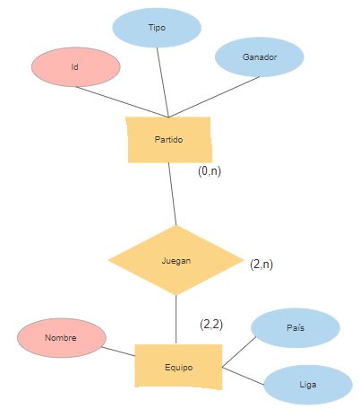
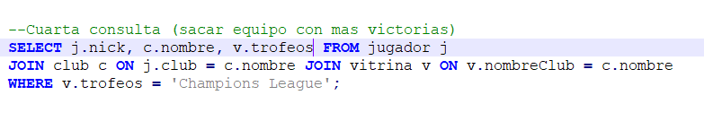
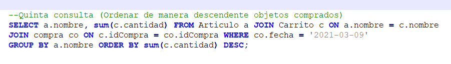

##  

**Práctica 1**

Gestión de Datos en Medios Digitales

**─**

*Raúl Fernández Ruíz*

*Aitor García Prádanos*

*Jaime Jiménez López*

*Asier Menéndez Mendoza*

#

**ÍNDICE**

1.  *Propuesta y parte a modelar*

2.  *Entidades y relaciones*

3.  *Diseño de un esquema conceptual que refleje la propuesta*

4.  *Implementación de la base de datos*

5.  *Referencias*

<!-- -->
#

1.  **Propuesta y parte a modelar**

En nuestro caso hemos escogido como juego el FIFA 20 perteneciente a la
empresa Electronic Arts (EA), perteneciente al género de los deportes en
concreto el fútbol.

El principal atractivo y despegue de esta saga de videojuegos llegó con
la inclusión de un modo multijugador que en los últimos años han ido
ampliando con diferentes modos (ultimate team, partidos por
divisiones...). Ya lleva mucho tiempo siendo el videojuego más comprado
del género deportivo, y manteniendo una entrega anual todos los años.

Entonces se puede resumir la esencia del FIFA 20 como un juego sobre
fútbol basado en una componente multijugador-competitiva muy fuerte y un
sistema de micropagos donde podemos comprar nuevas indumentarias para
nuestro equipo, campos, jugadores…

Las partes del juego que se van a modelar son cuatro:

- <u>Sistema cliente de EA:</u> para jugar online es necesario tener una
  cuenta de Play Station, Xbox.... Esta cuenta será la que usaremos para
  hacer compras dentro del juego, poder jugar online, añadir amigos…
  Mediante esta cuenta se guardará información del usuario para mantener
  la experiencia y los objetivos logrados.

  

- <u>Modalidad de poder jugar partidos online:</u> como ya hemos
  comentado anteriormente la componente multijugador es algo clave en
  esta saga de juegos, por ello vamos a emular como funciona dentro del
  juego. Es importante que la versión online que vamos a representar sea
  la más clásica, donde lo único que necesitan ambos jugadores es elegir
  un equipo (ya que existen modalidades más complejas donde cada jugador
  puede crear su propio equipo). Para poder jugar partidos de manera
  online necesitaremos acceder a nuestra cuenta. Normalmente se
  emparejarán jugadores pertenecientes a la misma región del mundo para
  poder alojar el partido en un servidor común que permita que la
  conexión del partido sea buena para ambos.

  

- <u>Compras:</u> la otra componente clave para el éxito de la saga, la
  tienda in-game donde los jugadores pueden comprar equipaciones, botas,
  estadios, mejoras… para sus equipos. Se podrán realizar compras
  mediante la cuenta.

  

- <u>Equipos y jugadores:</u> la última parte que vamos a modelar será
  la representación de los diferentes equipos y jugadores dentro del
  juego.

  

Viendo todos los componentes que vamos a modelar, podemos empezar a
hacernos una idea sobre los datos que necesitaremos almacenar.

Por un lado, tendremos que guardar toda la información relacionada con
las cuentas de los jugadores ya que es la componente básica que nos
permite realizar todas las acciones dentro del juego. Para el sistema
online tendremos que guardar información sobre que jugadores han jugado
el partido, región para un correcto emparejamiento y evitar lag... y
para la tienda necesitaremos guardar información sobre qué tipos de
artículos se encuentran disponibles en ésta.

Por último, tendremos que guardar la información sobre qué jugadores
forman un equipo, sus estadísticas, etc.

<u>¿Pero por qué es importante el correcto uso de la base de datos en
FIFA 20?</u>

Como ya sabemos, FIFA 20 es un juego online por lo tanto la gestión de
los datos se debe tratar de hacer de una manera eficiente para evitar
problemas como pérdidas de datos de los usuarios, lag, etc... Por
ejemplo, si dentro de la tienda no fuéramos capaces de gestionar los
artículos que hay almacenados en ella y los jugadores no pudieran
acceder a ella ya estaríamos perdiendo la principal fuente de ingresos
del juego.

Algo parecido sucede con las cuentas de los jugadores, si tuviéramos un
error y perdiéramos información sobre sus cuentas o se filtraran podría
llevar a sanciones económicas y pérdida de jugadores potenciales del
juego.

Por último, si los datos para el modo multijugador se gestionaran mal
podría dar lugar a que los jugadores fueran asignados a un servidor de
una región distinta a la suya provocando conexiones muy altas (lag) y
que los jugadores no pudieran disfrutar del juego, o que si hubiera
muchos jugadores accediendo de manera simultánea al juego los servidores
de EA se cayeran debido a que no son capaces de gestionar toda esa
información de manera eficiente.

#

2.  **Entidades y relaciones**

Como hemos visto vamos a modelar cuatro aspectos: el sistema cliente,
los equipos y jugadores, sistema online y las compras.

Comenzaremos por el sistema online, una entidad será el **servidor.**
Ésta representaría los servidores de los que dispone la empresa para dar
conexión online donde cada servidor tendrá un identificador (int, Clave
Primaria (CP)) que nos permitirá diferenciarlo del resto, además de
contar con más atributos como la región (varChar, Not NULL(NN)) donde se
encuentra el servidor (algo muy importante a la hora de emparejar gente
para evitar problemas de conexión) y por último el número de salas de
las que dispone ese servidor (int, NN) (los jugadores juegan en salas
que son ofrecidas por el servidor).

El servidor nos lleva a crear una nueva entidad que serán las **salas,**
esta entidad recogerá las salas donde un jugador juega una partida
online contra otro jugador. Cuentan con un identificador (int, CP) que
hará posible diferenciarlas unas de otras. Ya viendo estas dos entidades
podemos hacernos una idea de cómo se relacionan, un servidor puede
ofrecer muchas salas **(\|1,N\|)**, y una sala pertenece a un único
servidor **(\|1,1\|)**.

Ahora pasamos a ver la siguiente entidad que serían los **partidos,**
esta entidad lo que representa sería el enfrentamiento entre dos equipos
elegidos por dos jugadores, cada partido tiene un identificador (int,
CP) único que nos permite diferenciarlo del resto de partidos online,
además de indicarnos el tipo de partido (varChar, NN) (partido normal,
bola misteriosa, sin reglas, final de la champions ...). También tenemos
un atributo que determina el ganador del partido (varChar, NN), el cual
será el nombre del equipo ganador.

¿Pero si los partidos son online dónde se están jugando? Aquí es donde
se relaciona con la entidad anterior de las salas, ya que un partido se
juega dentro de una sala. De aquí ya podemos ver la relación entre salas
y partidos, un partido siempre se debe de jugar dentro una sala
**(\|1,1\|)**, sin embargo dentro de una sala puede ser que no se esté
jugando ningún partido (poca afluencia de gente dentro del servidor) o
que se esté jugando uno o más partidos **(\|0,N\|)**.

La entidad **equipo** contiene la información de todos los equipos del
juego y jugables por los usuarios. Consta de tres atributos que son el
nombre del equipo(varChar, CP), el país(varChar, NN) y el nombre de la
liga al que pertenecen(varChar, NN), ya que estos ayudarán al usuario a
buscar más fácilmente el equipo con el que quieren jugar. La entidad
equipo se relaciona con el partido que es disputado entre dos jugadores
en una sala online, ya que los jugadores pueden jugar el partido
mediante los equipos seleccionados. Por lo tanto, un partido es jugado
siempre por dos equipos que se enfrentan **(\|2,2\|)**, y los equipos
pueden no haber sido seleccionados para jugar un partido (por ejemplo un
equipo poco conocido y que nadie lo seleccione) o estar jugando varios
partidos a la vez, esto significa que puede ser que en el partido de la
sala 1 esté jugando el equipo A contra el B, y en la sala 2 el equipo A
contra el C **(\|0,N\|)**.

En la entidad **futbolistas** se recogen todos los jugadores disponibles
dentro del juego. Cada futbolista consta de su nombre (varChar, CP), su
edad (int, NN) y su media (int, NN). Los futbolistas se relacionan
únicamente con la entidad equipo, ya que un equipo está formado por
futbolistas, entre 18 y 23 ya que depende de si el jugador ha añadido
reservas o no **(\|18,23\|)**, y un futbolista siempre debe pertenecer a
un equipo **(\|1,1\|)**.

Ahora pasamos a la entidad **jugador**, como vimos en el primer punto
para poder acceder a las funciones online necesitamos una cuenta (ya sea
de Playstation, Xbox...)(). Cada cuenta tiene un nickname (varChar, CP)
único que la diferencia del resto, también tiene un atributo único que
nos permite saber cual es la cuenta de Origin (varChar, puede ser NULL)
si el jugador la tuviera (estos tipos de cuentas se suelen usar para
mejorar la seguridad de la cuenta, obtener recompensas… pero suele ser
opcionales tenerlas, como es el caso). Se pueden encontrar otros
atributos como la división (varChar, NN) en la que se encuentra el
jugador, que vendrá determinada por la cantidad de victorias. También
tiene un contador de monedas (int, NN) las cuales se podrán utilizar
para realizar las compras dentro del juego. Los jugadores se unirán a un
partido (que se aloja en una sala) donde seleccionarán los equipos y
comenzarán el partido, entonces un jugador se debe unir a un partido
para poder jugar **(\|0,1\|),** la cardinalidad es \|0,1\| porque un
jugador no tiene por qué unirse a un partido, y como máximo puede entrar
en un partido a la vez, y un partido necesita de dos jugadores para
comenzar **(\|2,2\|)**.

Como se puede observar en la imagen, en la izquierda tenemos tanto el
nick del jugador 1 como el equipo seleccionado y en la derecha el nick
del jugador 2 con el equipo seleccionado. Esta foto representa
perfectamente la entidad partido y su relación con equipo y jugador.

También hemos querido reflejar el sistema de clubes formados por amigos
que pueden jugar torneos contra otros jugadores que también forman un
equipo en la entidad **club,** donde el nombre del club (varChar, CP)
será su clave primaria que lo diferencie del resto para evitar que haya
dos clubes que se llamen de la misma manera y un contador (int, NN) que
nos indique el número de miembro de ese equipo. La entidad club y
jugador se relacionan de la siguiente manera, un jugador puede
pertenecer a un club o no,ya que esto es opcional **(\|0,1\|)**, y un
club tiene que tener como mínimo un jugador para poder existir, sin
máximo de jugadores **(1,N)**.

Luego hemos querido añadir el sistema de trofeos, por ello hemos creado
la entidad **vitrina** que refleja todos los títulos ganados por un club
y en qué año lo hicieron. Cuenta con dos atributos que identifican el
año (int) y nombre del título(varChar)(ambos son CP), hacemos esto
porque así evitamos que un título ganado en un mismo año pueda estar dos
veces en la vitrina y así solo pertenece a un club. Por lo tanto una
vitrina se tiene que relacionar como mínimo y máximo con un equipo
**(\|1,1\|)**, y un equipo solo tendrá un vitrina donde guardar sus
trofeos **(\|1,1\|)**.

La siguiente entidad será la **compra,** donde vamos a reflejar todas
las compras por los jugadores realizadas dentro del juego. Cada una
tiene un identificador (int, CP) único que diferencia una de otra, y la
fecha (date, NN) en la que se realiza. Entonces la compra se relaciona
con el jugador, este puede hacer varias compras o ninguna **(\|0,N\|)**
y una misma compra puede ser realizada por un único jugador
**(\|1,1\|)**.

La última entidad será la de **artículo**, que estará definida por un
nombre de artículo (varChar, CP) único que lo diferencia del resto y el
precio del artículo (int, NN). Los artículos se relacionan con compra,
ya que una compra puede estar formada por uno o varios artículos
**(\|1,N\|)** y el artículo puede pertenecer a 0 o a varias compras
**(\|0,N\|)**, de esta manera hacemos que un mismo artículo pueda
pertenecer a varias compras diferentes.

#

3.  **Diseño de un esquema conceptual que refleje la propuesta**

Para finalizar el UML vamos a hacer el paso a tablas de nuestro modelo
entidad relación, así que vamos a ir analizando cada una de las
relaciones entre las entidades y así poder determinar las claves ajenas.

- Servidor-Sala: al ser la cardinalidad de la relación \|1:N\|,
  basándonos en las reglas del paso a tablas, hemos determinado que en
  la entidad sala debemos incluir un clave ajena que hace referencia al
  id del servidor. El id de la sala y la del servidor formarán la clave
  primaria, permitiéndonos que el servidor 1 tenga la sala 1,2,3.., el
  servidor de la sala 1,2,3…

  

- Sala-Partido: tenemos el mismo caso que antes, la cardinalidad de la
  relación es \|1:N\|, por tanto la entidad partido tendrá una clave
  ajena que nos permitirá identificar el id de la sala y del servidor.
  Hacemos esto porque si por ejemplo solo usamos una clave ajena como
  podría ser el identificador de la sala no podríamos obtener el
  servidor al que pertenece esa sala en las consultas (ya que existe la
  sala 1 del servidor 1, sala 1 servidor 2, etc.).

  

- Partido-Equipo: en este caso la cardinalidad de la relación es
  \|2:N\|, ya que para jugar un partido necesitamos dos equipos,
  siguiendo las reglas del paso a tablas añadiremos dos claves ajenas en
  la entidad partido que representarán el nombre de los dos equipos que
  juegan el partido. Al hacer esto conseguimos que cada vez que se
  juegue un nuevo partido tendremos referenciados qué equipos han jugado
  este partido con estas dos claves ajenas.

  

- Equipo-Futbolistas: al ser la cardinalidad de la relación \|1:23\|, ya
  que un futbolista solo puede pertenecer a un equipo y un equipo puede
  estar formado hasta por 23 jugadores. Añadimos una clave ajena que
  identifica el nombre del equipo al que pertenece el jugador.

  

- Partido-Jugador: la cardinalidad de la relación es \|1:2\|, ya que
  para jugar un partido necesitamos dos jugadores, y un jugador solo
  puede jugar un partido al mismo tiempo. Siguiendo las reglas del paso
  a tablas la clave ajena debería estar en jugador, pero hemos decidido
  ponerla en partido por el siguiente motivo, si la entidad jugador
  representa a las cuentas de los jugadores no le vemos el sentido a que
  cada vez que se juegue un nuevo partido se añada una nueva entrada a
  la entidad jugador referenciando este partido, por ello la hemos
  puesto en partido ya que nos parece más lógico que cada vez que se
  juega un nuevo partido se añada a la entidad partido y esta referencia
  a los jugadores que han jugado dicho partido mediante sus nicks.

  

- Jugador-Club: la cardinalidad de la relación es \|1:N\|, debido a que
  un jugador forma parte de un club y a este club pueden pertenecer
  muchos jugadores. Por ello, se crea una clave ajena en jugador
  denominada club la cual guardará el nombre del club al que pertenece
  el jugador, como es opcional unirse a un club esta clave puede ser
  NULL.

  

- Club-Vitrina: la cardinalidad de la relación es \|1:1\|, basándonos en
  las reglas de paso a tabla aparecerá una clave ajena en vitrina
  referenciando el nombre del club al que pertenece.

  

- Jugador-Compra: en este caso la cardinalidad de la relación es
  \|1:N\|, por lo tanto dentro de compra tendremos una clave ajena que
  nos indique el nick del jugador que ha realizado la compra.

  

- Compra-Artículo: la cardinalidad de la relación es \|N:M\|, por lo
  tanto siguiendo las reglas del paso a tablas, aparecerá una nueva
  tabla a la que llamaremos carrito. Ésta estará formada por dos claves
  ajenas que nos referencian el nombre del artículo y el id de la
  compra, además de un atributo que nos indica la cantidad de cada
  artículo comprado. La clave primaria de carrito es compuesta, con esto
  estamos diciendo dos cosas, que en una compra no se puede comprar el
  mismo artículo dos veces y que en una compra se pueden comprar varios
  artículos.

<!-- -->

- Compra-Carrito: la relación es \|1:1\|, ya que una compra posee un
  solo carrito, y un carrito pertenece a una sola compra.

- Carrito-Artículo: la relación es \|1:N\|, ya que un carrito puede
  estar formado por varios artículos, y un artículo pertenece a un solo
  carrito en cada compra.

  

#

4.  **Implementación de la base de datos**

Para empezar creamos todas las tablas de las entidades que han sido
determinadas para formar la base de datos, cada una con sus atributos y
restricciones correspondientes.

Después tenemos que insertar los datos en las tablas creadas. Para ello
hemos utilizado la herramienta Excel. El proceso que hemos seguido ha
sido crear una tabla con sus respectivas celdas. En otra se ha puesto la
cadena “INSERT INTO Tabla VALUES(“ y después se ha utilizado la función
“=CONCATENAR()” para poder referenciar cada fila de la tabla y poder
desarrollar más fácilmente las líneas de código para las inserciones. A
continuación se muestra un ejemplo:

Las consultas que hemos realizado son las siguientes (los INSERT que
hemos hecho en las tablas en el SQL aparecen todos seguimos, pero para
que queda más claro aquí pondremos los INSERT junto a sus consultas):

- <u>Primera consulta (simple sobre una tabla con filtro)</u>: Como
  nombramos anteriormente tener la cuenta Origin es algo opcional, y los
  jugadores que las tienen suelen recibir bonificaciones cada x tiempo,
  en nuestro caso hemos decidido aumentarles el número de monedas.
  Primero hacemos el update de la tabla jugadores, para ello le decimos
  que les sume 30 a la cantidad actual de sus monedas, pero solo a
  aquellos que tienen registrada su cuenta Origin, luego hemos hecho un
  select para ver que se les a aumentado las monedas (la segunda foto se
  corresponde con un select de toda la tabla jugadores, para ver que no
  se ha modificado a otros juagdores) .

  

  Para esta consulta se han realizado estas inserciones de datos:

  

  Para ver que funciona insertamos dos datos de prueba en jugadores:

  

  Tras ejecutar esta sentencia nos queda así la tabla:

  

- <u>Segunda consulta (simple sobre alguna tabla con alguna
  función)</u>: Queremos seleccionar al jugador con la máxima media para
  hacerle una carta especial, la cual luego venderemos en los sobres de
  la tienda. Hacemos una select de la tabla futbolistas, pero solo
  queremos al que más media tenga, para ello usamos la función max sobre
  el atributo media.

  

  Para esta consulta se han realizado estas inserciones de datos:

  

  Estos son los futbolistas que tenemos de prueba para la consulta:

  

  Tras hacer la segunda consulta nos devuelve esto:

  

- <u>Tercera consulta (Join, combinación de varias tablas)</u>: En
  juegos donde los jugadores pueden hacer compras es muy importante
  tener un registro de qué artículos ha comprado cada jugador y la
  cantidad por si hubiera algún tipo de problema como que se le hubiera
  robado la cuenta o quisiera hacer una devolución. En esta consulta
  realizamos un select para sacar el nombre del jugador que ha realizado
  compras, el nombre del artículo comprado y cuanta cantidad. Por esto
  realizamos dos join, en el primero unimos la tabla jugador con compra
  mediante el atributo nick que es una clave ajena en la tabla compra
  que referencia a jugador, y en el segundo la tabla carrito con la
  tabla compra mediante el idCompra que es una foreign key de la tabla
  carrito que referencia a compra, usamos el order by para que lo ordene
  por el nick del jugador y salga más ordenado.

  

  Para esta consulta se han realizado estas inserciones de datos:

  

  En esta consulta primero vamos a ver cómo está el carrito, como
  podemos ver se han hecho dos compras la 1 y la 3, que la 1
  corresponderá a un jugador y la 3 a otro.

  

  Tras ejecutar la consulta podemos ver que idCompra 1 correspondería
  con Aitor y el idCompra 3 con Jaime.

  

- <u>Cuarta consulta (Join, combinación de varias tablas con
  filtrado)</u>: en este juego hay equipaciones conmemorativas de
  eventos. Por eso se quiere saber qué jugadores han ganado el trofeo de
  la Champions para otorgarles dicha equipación. Se realiza un select
  donde se saca el nombre del jugador/jugadores que pertenece al club/
  clubes que han ganado la Champions League. Para ello, realizamos dos
  joins, el primero sirve para unir la tabla jugador con club mediante
  la clave ajena club existente en la tabla jugador que referencia al
  atributo nombre de la tabla club y el segundo join mediante el cual
  unimos la tabla club con vitrina mediante el nombre del club, que será
  una clave ajena en la tabla vitrina. Para finalizar realizamos un
  filtrado donde el trofeo se la Champions
  League.

  

  Para esta consulta se han insertado los siguientes datos:

  

  Podemos ver que hay dos clubes, queremos ver cuál de ellos ha ganado
  la jugadores han ganado la Champion y los miembros de ese club.

  

  En la vitrina podemos ver que el equipo que ha ganado la Champions es
  el club FreeFire.

  

  Los jugadores que tenemos que obtener son Jaime y Raúl

  

  Como vemos sale el nombre de los jugadores del club que han ganado la
  Champions.

  

- <u>Quinta consulta (Group by simple)</u>: En juegos competitivos es
  muy importante que esté lo más balanceado posible, por ello queremos
  sacar las victorias de todos los equipos para ver quienes tienen más.
  Se realiza un select donde se saca el nombre de los equipos que han
  ganado partidos y el número de victorias conseguidas por cada uno de
  ellos. Finalmente se agrupa por el nombre del equipo ganador y se
  ordena dependiendo de la victoria de manera descendente.

  

  Para esta consulta se han insertado los siguientes datos:

  

  

  Aquí podemos ver todos los partidos jugados y los equipos que han
  ganado cada partido.

  

  Como podemos ver el resultado coincide con las partidos que ha ganado
  cada equipo

  

- <u>Sexta consulta(Group by, con combinación de varias tablas,
  filtrados y función de agregación)</u>: al sacar un nuevo artículo a
  la venta, el equipo quiere saber si ha tenido éxito. Por eso se pide
  saber qué artículos se han vendido ese día para poder comparar con el
  resto. Se realiza un select donde saca el nombre del artículo que ha
  sido comprado en distintas compras, y su cantidad. Para ello tenemos
  que unir la tabla articulo con la tabla carrito mediante la clave
  ajena nombre presente en carrito, la cual hace referencia a la tabla
  artículo. El segundo join sirve para unir el carrito con la tabla
  compra mediante el idCompra, clave ajena de la tabla carrito la cual
  hace referencia a la tabla compra. Finalmente se filtra por la fecha
  de compra, se agrupa por el nombre del artículo y se ordena por la
  cantidad de los artículos de manera descendente.

  

  Para realizar esta consulta se han insertado los siguientes datos
  además de los que ya había:

  

  Como podemos ver se han hecho dos compras en la fecha que queremos.

  

  En la tabla carrito vemos que entre las compras de Aitor y Jaime, nos
  debería dar 9 botas y 4 estadios.

  

  Y la consulta nos devuelve el resultado correcto

  

  Por último hemos hecho algunas inserciones de datos en las tablas que no
  hemos utilizado para realizar las consultas:

  

#

5.  **Referencias:**

Para realizar el paso a tablas hemos utilizado este pdf como fuente:

[<u>http://di002.edv.uniovi.es/~fcano/bdatos/materiales/paso-a-tablas.pdf</u>](http://di002.edv.uniovi.es/~fcano/bdatos/materiales/paso-a-tablas.pdf)

Hemos utilizado esta herramienta para probar toda nuestra base de datos:

[<u>https://sqliteonline.com/</u>](https://sqliteonline.com/)

Para realizar el entidad relación hemos utilizado esta aplicación:

[<u>https://www.smartdraw.com/?id=104607&gclid=Cj0KCQiA-aGCBhCwARIsAHDl5x8O1ZmOwNrbtNKcaadyUTUUaGrOqOnHhv84ZlYkQD8-Qa0KwVy3QCkaAkkeEALw_wcB</u>](https://www.smartdraw.com/?id=104607&gclid=Cj0KCQiA-aGCBhCwARIsAHDl5x8O1ZmOwNrbtNKcaadyUTUUaGrOqOnHhv84ZlYkQD8-Qa0KwVy3QCkaAkkeEALw_wcB)

Para realizar el entidad relación hemos usado creately:

[<u>https://creately.com/</u>](https://creately.com/)
