##  

**Práctica 2**

Gestión de Datos en Medios Digitales

**─**

*Raúl Fernández Ruíz*

*Aitor García Prádanos*

*Jaime Jiménez López*

*Asier Menéndez Mendoza*

#

**ÍNDICE**

1.  *Estructura de los documentos propuestos*

2.  *Generación de documentos*

3.  *Validación de documentos*

4.  *Diseño de operaciones FLOWR*

5.  *Referencias*

#

<!-- -->

1. **Estructura de los documentos propuestos**

Partiendo de la idea inicial para modelar nuestro videojuego, el FIFA,
queremos representar el sistema de servidores del juego, los equipos y
futbolistas disponibles, las cuentas de los usuarios, el sistema de
compras dentro de la tienda del juego, los partidos que se pueden
jugar de manera online contra otros jugadores, los clubes de amigos
que pueden formar los usuarios para disputar torneos y por último, los
momentos más destacados de cada partido. También queremos explicar en
qué criterios nos basamos para definir información como elementos o
atributos, para esto nos apoyamos en dos principios:

- Principio de la información estructurada: nos dice que si queremos que
  nuestra información sea estructurada usemos elementos, si la queremos
  resumida atributos.

- Principio de legibilidad: nos dice que si la información va a ser
  usada por humanos usar elementos, si va a ser usada por máquinas mejor
  atributos.

Viendo estos principios es lógico pensar que si la información va a
ser tratada únicamente por máquinas, es mejor usar atributos ya que a
ellas no les importa que la información sea más o menos legible y
además al añadir la información como atributos les facilitamos las
consultas, ya que los árboles de los documentos tienen menos
profundidad. Pero como en nuestro caso la información si que va a ser
tratada por personas lo haremos lo más estructurado y legible posible
para facilitar su comprensión. Por lo tanto nuestro criterio será que
si esta información es esencial para el XML lo definimos como elemento
(es decir es información que podría ser el resultado de una consulta),
en cambio si es una información que sirve para evitar elementos
repetidos, distinguir entre ellos… lo definimos como atributo.

Partiendo de esta idea hemos generado los siguientes documentos:

- Servidor: este documento representa el sistema de servidores de los
  que dispone la compañía, primero tendremos una entidad padre
  (servidores) que contendrá a todos los servidores de los que dispone
  la empresa, como vemos cada servidor tiene un identificador único que
  lo diferencia del resto, lo hemos definido como atributo ya que como
  hemos visto antes la principal función de esto es evitar elementos
  repetidos y permitir diferenciarlo de otros, también definimos la
  región donde se encuentra el servidor, nos vimos obligados a definirlo
  como elemento, ya que al usar la función CDATA la cual nos permite
  escribir tildes, diéresis ya que evita que el documento interprete
  este texto. Por último, tenemos las salas que pertenecen a ese
  servidor, cada sala es única dentro de nuestro documento, con esto lo
  que estamos representando es que si nuestra empresa tuviera 100 salas
  las cuales son alojadas en diferentes servidores, podríamos tener las
  salas del 1 al 20 en el servidor de Alemania, del 21 al 41 para
  Italia…

  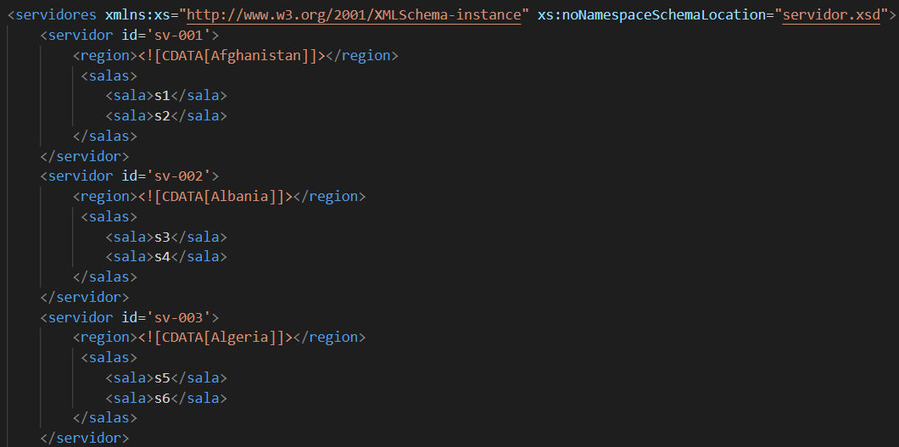

  Nuestro documento servidor se relaciona con el documento partidos, ya
  que en un servidor se pueden llegar a jugar n partidos, sin embargo un
  partido siempre se juega en una única sala perteneciente a un
  servidor. En el documento partidos veremos esta relación, pero se basa
  en que dentro de cada partido tenemos una entidad sala, que refleja en
  que sala se jugó el partido, de esta manera conseguimos que un partido
  como mínimo y máximo se juega en una única sala (ya que es una
  restricción), sin embargo esa misma sala se puede repetir en más
  partidos.

  

- Compras: aquí reflejamos todas las compras que han realizado los
  usuarios dentro de la tienda virtual del juego. Tenemos una entidad
  padre compras que contendrá todas las compras que se han realizado en
  la tienda, como vemos cada compra tiene un identificador único que la
  diferencia del resto, la definimos como atributo ya que al igual que
  antes nos está aportando información para diferenciar entre elementos,
  dentro encontramos diferentes elementos que reflejarán la información
  más importante de una compra. Por un lado el usuario que realizó la
  compra, todos los artículos que compró en esa compra, indicando el
  nombre y tipo del artículo comprado, las unidades compradas de ese
  artículo, y el precio total de la compra de ese artículo.

  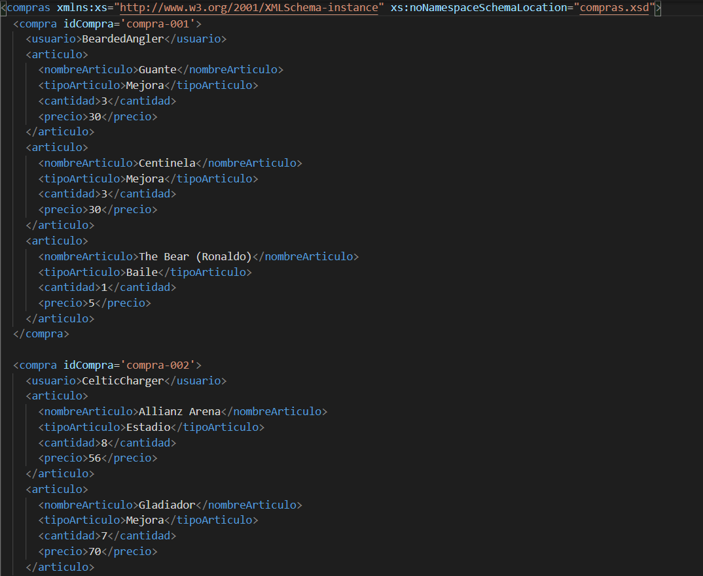

  Nuestro documento compras se relaciona con el documento jugadores
  (donde se almacena la información de todos los usuarios del juego), ya
  que un usuario puede realizar múltiples compras pero una compra
  siempre pertenece a un usuario. Esto lo reflejamos mediante el
  elemento usuario de cada compra, ya que como mínimo y máximo una
  compra siempre debe pertenecer a un usuario, pero un mismo usuario
  puede aparecer en múltiples compras.

  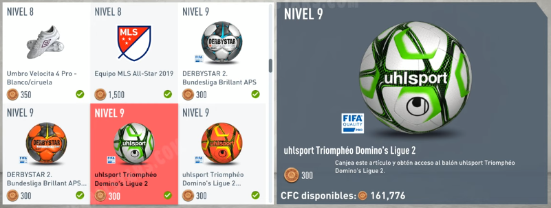

- Jugador: representa a los usuarios dentro de nuestro juego, dentro del
  elemento jugadores almacenaremos a todos los usuarios del juego. Cada
  usuario dentro de nuestro juego se representa como un elemento
  jugador, el cual tiene un identificador único que lo diferencia del
  resto, al igual que en los casos anteriores lo definimos como un
  atributo el nombre del usuario que nos permitirá diferenciarlo del
  resto, y luego contiene otros elementos los cuales nos permiten
  construir a un usuario dentro del juego, son la división del modo
  online en la cual se encuentra el jugador (división 1 es la de más
  alto nivel y la décima la de menor), también tenemos las monedas de
  las cuales dispone el jugador para realizar compras dentro de la
  tienda del juego, y los dos siguientes elementos son opcionales ya que
  pueden aparecer o no (en este caso lo generamos de manera aleatoria),
  el elemento de cuenta Origin indica si el jugador dispone de una
  cuenta de este tipo (este tipo de cuentas especiales que pertenecen a
  determinadas compañías se suelen usar para fines publicitarios,
  obtener ofertas de los juegos de esa compañía… con la intención de
  fidelizar más al jugador), si el usuario no dispone de cuenta Origin
  el elemento no aparecerá (como podemos ver en el usuario Pixels), el
  funcionamiento es el mismo con el elemento club, el cual representa si
  el usuario pertenece a algún club para poder jugar torneos con otros
  usuarios.

  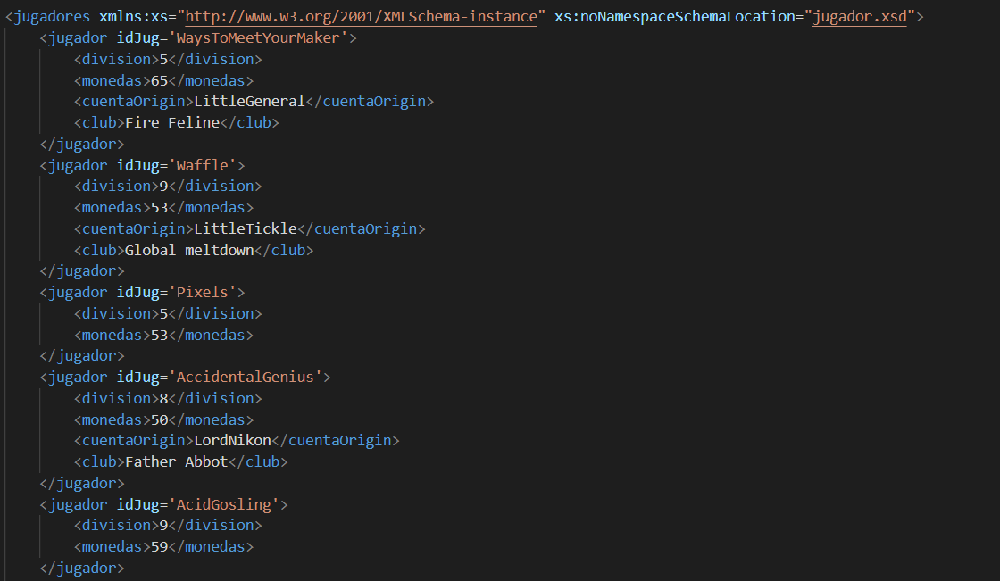

  Este documento se relaciona con otros tres:

  - Documento partidos: un usuario puede jugar n partidos online, y un
    partido siempre debe ser jugado por dos jugadores. Esta relación la
    hemos representado en el documento partidos (lo veremos más adelante),
    usando dos entidades jugador que representará a cada uno de ellos, con
    esto logramos que un partido siempre debe ser jugado por dos usuarios
    (es una restricción del xsd) y un mismo usuario puede aparecer en más
    partidos, representando que un jugador puede jugar n partidos.

  - Documento club: un jugador puede pertenecer a un club o ninguno, sin
    embargo a un club puede pertenecer n jugadores, dentro del documento
    jugador vemos esta relación, ya que el elemento club como hemos
    comentado puede no aparecer si el jugador no está asociado a ningún
    club o aparecer una sola vez si estuviéramos asociados a alguno, de
    está manera ya estamos representando que un jugador como máximo puede
    pertenecer a un solo club, sin embargo este elemento club se puede
    repetir en más jugadores, con lo que conseguimos que a un club puedan
    pertenecer n jugadores

  - Documento compras: esto ya lo vimos cuando explicamos el documento
    compras, ya que aquel elemento usuario aparecía como mínimo y máximo
    una sola vez por compra pero ese mismo usuario se podía dar en más
    compras (consiguiendo que una compra siempre pertenezca a un usuario
    pero un usuario pueda hacer n compras)

<!-- -->

- Club: representa a todos los clubes formados por usuarios para jugar
  torneos online, donde almacenaremos todos los trofeos que han ganado.
  Para ello tenemos el elemento padre clubes, que almacenará todos los
  clubes formados por los usuarios, definimos el nombre del club como un
  atributo que nos permitirá diferenciar un club de otro (al igual que
  en todos los casos anteriores lo definimos como atributo ya que nos
  está dando información sobre el elemento club), luego tendremos los
  elementos que nos permiten construir cada club (además debemos
  definirlos como elementos de manera obligatoria, ya que no tendríamos
  manera de representar varios trofeos como atributos, porque no se
  puede tener dos atributos que se llamen igual), dentro tenemos todos
  los trofeos que ha ganado un club, losdefinimos como atributos el
  nombre del torneo que ganaron y año en el que lo obtuvieron, ya que
  nos están dando información sobre la propia entidad trofeo.

  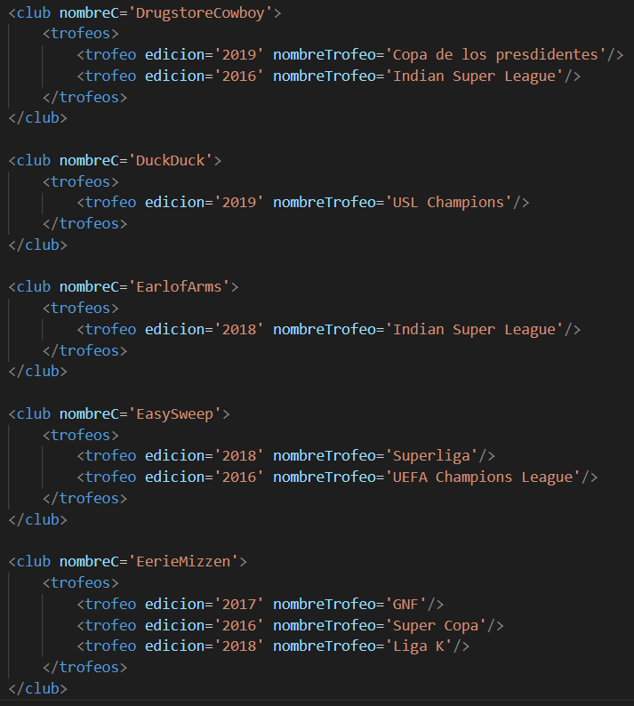

  El documento club solo se relaciona con el documento jugador, ya que
  como vimos un club podía estar formado por n jugadores, porque la
  entidad club se podía dar en varios jugadores, sin embargo un jugador
  como máximo pertenecía a un club.

  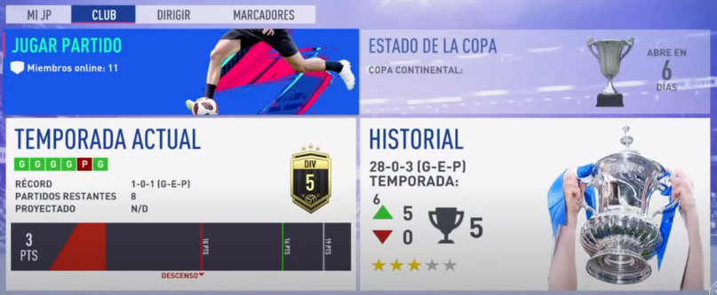

- Futbolista: aquí representamos a todos los futbolistas y equipos
  disponibles dentro del videojuego, esta decisión de juntar los equipos
  y jugadores del juego la decidimos tomar ya que al tener 100
  futbolistas crear un único documento para representar 6 equipos no nos
  parecía algo rentable. Este tipo de decisiones tiene más implicaciones
  ya que es cierto que de esta manera estamos aumentando la redundancia
  de los datos, pero favoreceríamos consultas que relacionan a los
  futbolistas con sus equipos ya que evitamos hacer joins, algo que
  puede ser muy costoso, especialmente si tenemos muchos datos.

  Tenemos una entidad padre futbolistas que almacena a todos los
  futbolistas de nuestro juego, cada futbolista cuenta con un atributo
  el cual es un identificador único que lo diferencia del resto,
  podríamos haber usado el nombre del futbolista pero esto podría dar
  problemas si tuviéramos dos o más futbolistas con el mismo nombre.
  Luego para construir el elemento futbolista usamos el nombre del
  futbolista, equipo al que pertenece (incluyendo nombre, país y liga),
  y por último un elemento cartas, esto es algo nuevo que hemos
  implementado respecto a la práctica pasada, ya que dentro del FIFA los
  jugadores tiene su carta normal, y luego en base a cómo les va la
  temporada, jugadas especiales que hacen, trofeos que ganan…, obtienen
  cartas especiales que son mejores que su carta base, en este caso
  tenemos tres tipos de cartas: carta normal (todos los jugadores tienen
  una), una carta destacado (cuando han sido uno de los jugadores más
  relevantes de la temporada) y una carta TOTY (cuando los jugadores se
  encuentran dentro del Team Of The Year, la mejor carta posible), estas
  dos últimas cartas pueden tenerlas o no, ya que generamos de manera
  aleatoria los datos(veremos esto en la generación de los datos).

  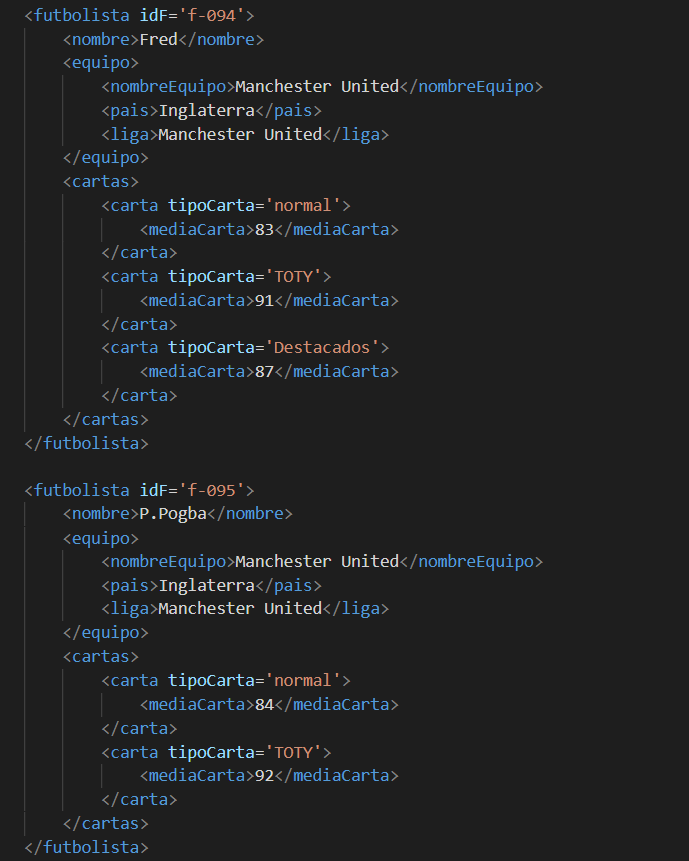

  El documento futbolista se relaciona con el documento partidos (en el
  documento partido veremos esta relación), ya que un partido es jugado
  por dos equipos, pero un equipo puede jugar n partidos, esto lo hemos
  representado mediante una entidad equipo dentro de cada partido, ya
  que siempre debe haber dos equipos que juegan el partido, pero ese
  mismo equipo puede aparecer en más partidos.

  

- Jugadas: para nosotros las jugadas dentro de nuestra base de datos son
  los eventos más destacados durante un partido, es decir, por cada
  partido almacenamos los usuarios y equipos que se enfrentaron, y luego
  tenemos un elemento jugadas que indica las cosas más importantes que
  han sucedido durante el partido, hemos definido estos eventos como los
  más importantes: si algún equipo ha metido un gol, se ha realizado un
  cambio o se ha sacado una tarjeta a algún futbolista.

  Por cada partido que se haya disputado tendremos un elemento partido
  con un atributo único que lo diferencia del resto, luego almacenamos
  tanto los jugadores como los equipos que se enfrentaron en el partido.
  Por último creamos un elemento jugadas donde estarán los eventos más
  importantes del partido, los eventos los generamos de manera aleatoria
  en cada partido. Siempre indicamos en qué minuto sucedió cada uno de
  estos eventos además los eventos siempre se muestran por orden del
  primero que sucedió hasta el último, en caso de gol indicamos el
  futbolista que lo anotó y el equipo al que pertenece, en caso de
  tarjeta indicamos si es amarilla o roja y futbolista al que pertenece,
  y en caso de cambio indicamos qué equipo realizó el cambio, además
  dentro de cambio puede aparecer un elemento lesión que significa que
  el jugador fue reemplazado debido a una lesión.

  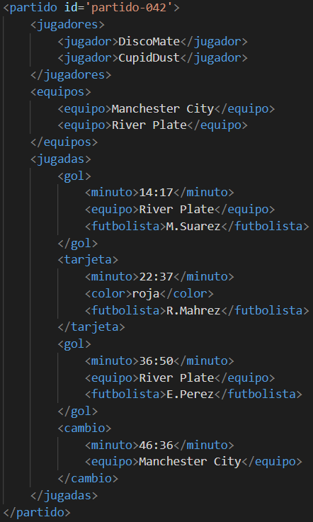

  El documento jugadas solo se relaciona con el documento partidos, ya
  que un partido siempre tiene un elemento partido dentro jugadas y
  viceversa, esta relación la hacemos mediante el identificador del
  partido dentro del documento jugadas ya que este identificador es el
  mismo que el tiene el partido dentro del documento partidos. Por
  hacernos una idea más clara de lo que representa cada documento:

  - El documento partidos se corresponderá con un resumen general de
    nuestro historial de partidas.

    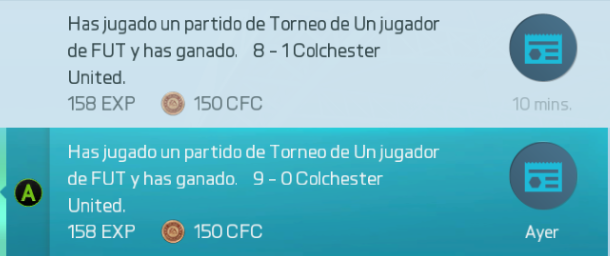

  - Y supongamos que pulsamos la tecla A de la foto de arriba, entonces
    iríamos a un resumen con más detalles del partido.

    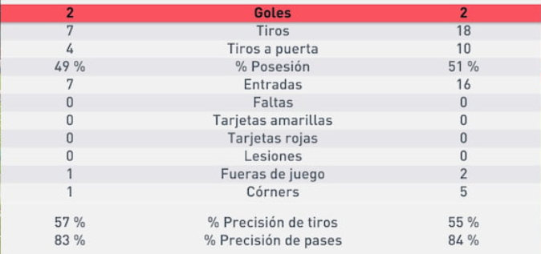

- Partidos: este documento refleja el historial de todos los partidos
  disputados entre los usuarios del juego, como vemos cada partido tiene
  un identificador único que lo diferencia del resto de partidos, dentro
  de cada partido almacenamos a los jugador que lo disputaron, equipos
  con los que se enfrentaron (el primer equipo corresponde al que usó el
  primer jugador y el segundo equipo al del segundo jugador), también
  indicamos el equipo y jugador que ganaron el partido. Por último
  señalamos en que sala online se alojo el partido.

  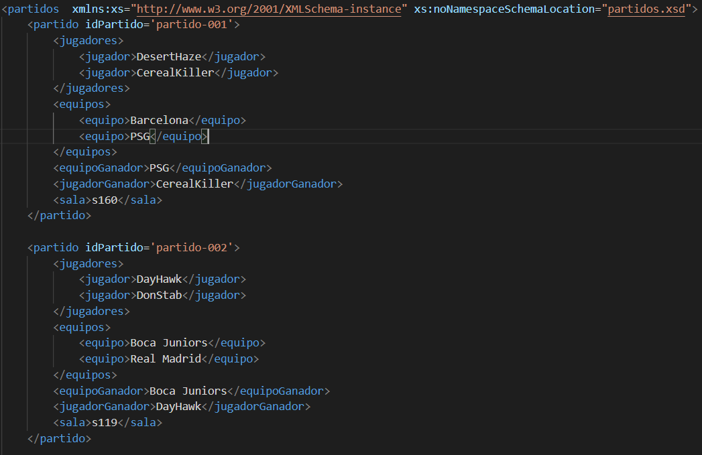

  El documento partidos se relaciona con varios documentos:

  - Servidor: como ya vimos un partido siempre se juega en un servidor
    (una sala de ese servidor) y en un servidor se pueden jugar n
    partidos. Para ello en cada partido tenemos un elemento sala que hace
    referencia a la sala en la que se juego el partido (este elemento
    aparece como mínimo y máximo una vez), sin embargo esa misma sala se
    puede repetir en más elementos partido.

  - Jugador: un jugador puede jugar n partidos pero un partido debe ser
    jugado por dos jugadores. Para reflejar esto creamos dos elementos
    jugador dentro de cada partido (siempre deben de ser dos), pero estos
    jugadores se pueden repetir en más elementos partidos (logrando que un
    jugador pueda jugar n partidos).

  - Futbolista: como ya vimos incluimos los equipos disponibles dentro del
    juego en el documento futbolistas, un partido es jugado por 2 equipos,
    pero un equipo puede jugar n partidos, para ello tenemos dos elementos
    equipos dentro de cada partido (siempre debe haber dos elementos
    equipo por partido, restricción xsd), sin embargo cualquiera de estos
    equipos se pueden repetir en más partidos

    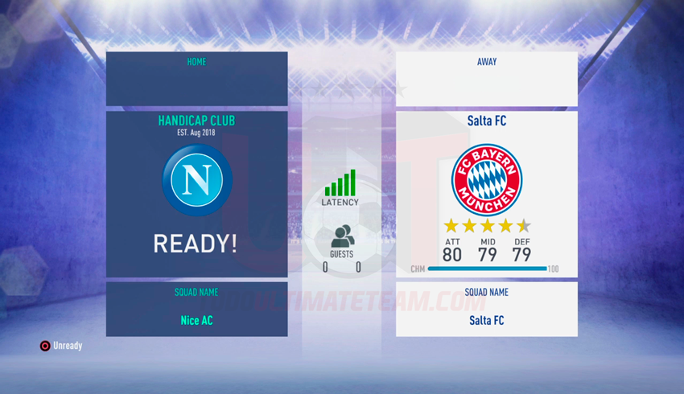

#

2.  **Generación de documentos**

Para la generación de los elementos hemos decidido utilizar el entorno
Eclipse y el lenguaje de programación JAVA. Nuestro método se basa en
ir creando programas que nos generen de manera automática los
documentos cumpliendo con la estructura que tengan, además para
realizarlo completamente automático (cosas como los nombres de los
usuarios, clubes de amigos…), leemos de un fichero, también es
importante señalar que en la generación de datos hemos añadido algunas
restricciones que no se podían añadir en xsd debido a algunas de sus
limitaciones . Ahora iremos viendo los diferentes .java que hemos
creado para ir generando todos los documentos:

- Servidor: encargado de generar los elementos del documento servidor.
  Cuenta con algunos métodos auxiliares como *generarServidores*
  (encargado de generar los ids de todos los servidores con la
  estructura que marcaba el xsd), *generarSalas* (donde generamos todas
  las salas de las que dispone la compañía) y *generarPaises* (donde
  leemos de un fichero una lista de países)

  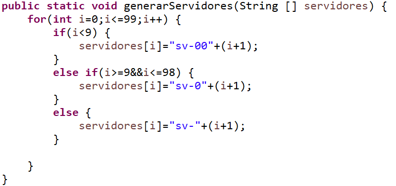

  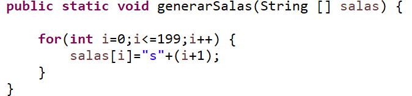

  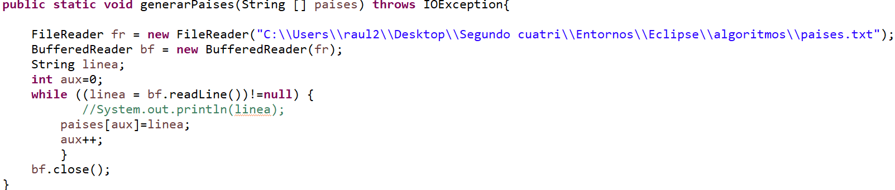

  A continuación tenemos el método principal el cual se encarga de
  generar todos los elementos, usando los métodos comentados
  anteriormente.

  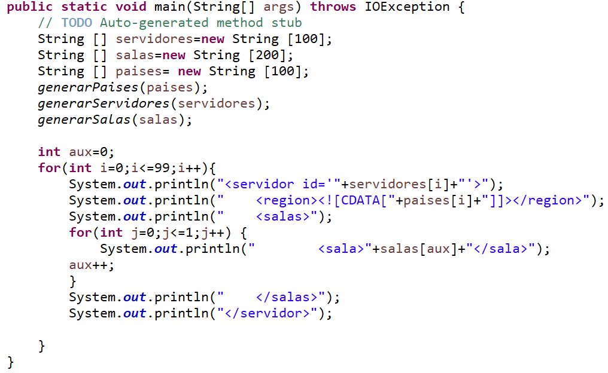

  Una ventaja de hacerlo con java es que podemos tabular las salidas de
  una manera muy sencilla obteniendo unos documentos mucho más fáciles
  de interpretar. Luego estas salidas las copiamos y pegamos en el XML.

  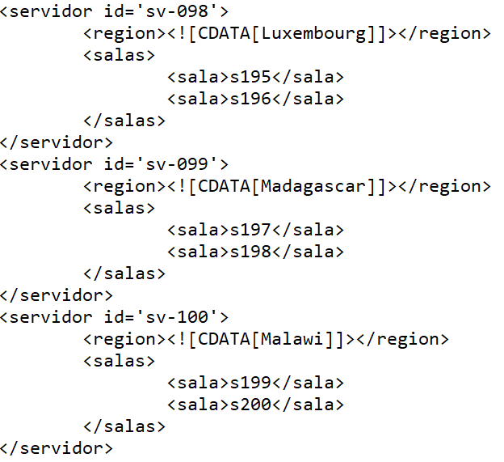

- Club: genera los elementos para el documento club,comenzando por los
  métodos auxiliares tenemos *generarClubes* (se encarga de leer de un
  fichero los nombres de los distintos clubs formados por amigos) y
  *generarTrofeos* (leemos de un fichero con las diferentes copas del
  mundo, y por cada trofeo generamos 5 ediciones distintas desde 2016 a
  2021), como hemos visto el método *generarTrofeos* usa una clase
  llamada trofeos, la creamos para facilitar la generación de los datos,
  cada trofeo cuenta con un nombre y el año en el que se disputó este
  trofeo.

  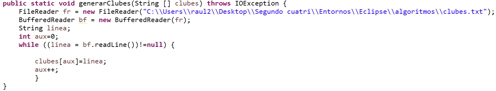

  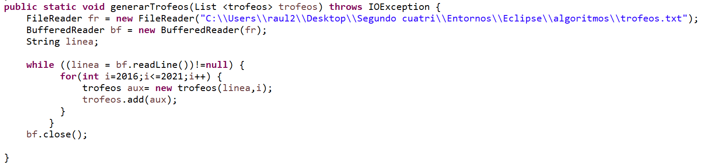

  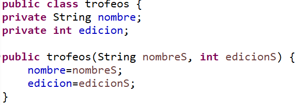

  A continuación tenemos el código encargado de generar los 100
  elementos, en este caso podemos ver como en el for interno usamos un
  número aleatorio para determinar el número de trofeos que puede tener
  un club (entre 1 y 3), lo hemos hecho para hacer que los datos sean
  algo más realistas y no tengan todos los clubes el mismo número y tipo
  de trofeos. También implementamos algunas de las restricciones las
  cuales xsd no era capaz de implementar, en este caso con la línea
  *trofeos.remove(trofeoRandom)* lo que estamos haciendo es que una vez
  un trofeo de un año determinado es añadido a algún club lo eliminamos
  de los futuros trofeos para otros clubes (es decir si el equipo A ganó
  la Champions en 2019 estamos consiguiendo que nadie más tenga este
  trofeo)

  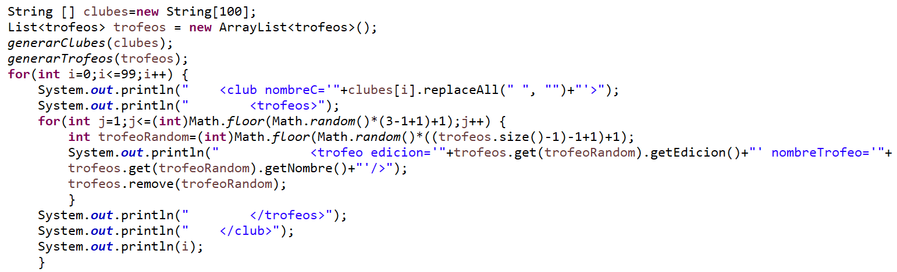

  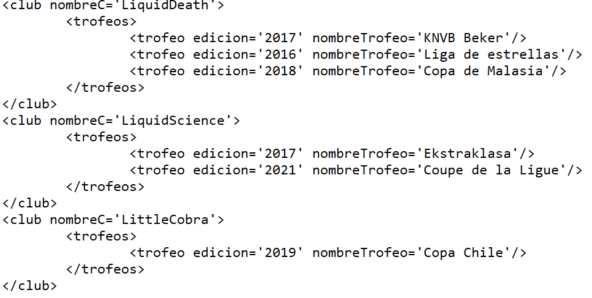

- Compras: genera los elementos para el documento compras, algunos de
  los métodos auxiliares son *generarUsuarios* (leemos del fichero de
  jugadores sus nombres y los guardamos), *generarArticulos* (se encarga
  de añadir todos los artículos de nuestro juego a un array, en nuestro
  tenemos tres tipos de artículos: bailes, estadios y mejoras para los
  jugadores) y *generarIdCompras* (generamos los diferentes ids para
  todas las compras cumpliendo con la estructura marcada por el xsd,
  compra- \[0-9\]\[0-9\]\[0-9\]), no adjuntamos foto del código de estos
  métodos porque son iguales a los que hemos visto en las anteriores
  clases, solo cambia el fichero de donde leemos o el nombre del id
  generado. Tenemos otros dos métodos auxiliares únicos de esta clase,
  *devolverTipo* (en base al número del identificador del objeto sabemos
  de qué tipo es, si un baile, mejora o estadio) y *precios* (en base al
  valor del identificador del objeto sabemos su precios, los bailes
  cuestan 5, las mejoras 10 y los estadios 7).

  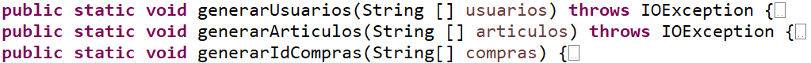

  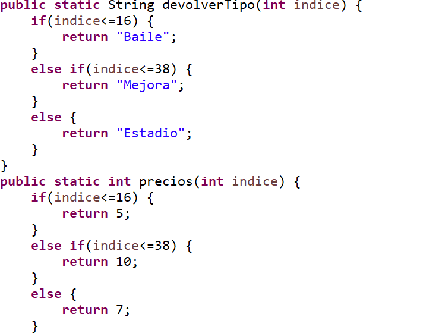

  Luego en el código principal generamos los 100 elementos, el número
  generado aleatoriamente en el segundo for se encarga de definir el
  número de artículos comprados en una compra (desde 1 a 5), luego
  generamos de manera aleatoria el artículo comprado y el número de
  unidades compras de ese artículo (y si multiplicamos el número de
  unidades de compras de ese artículo por el precio del artículo tenemos
  el precio total de la compra). También implementamos otras restricción
  la cual xsd no era capaz de implementar, la instrucción
  *!objetosComprados.contains(articuloComprado)* de lo que se encarga es
  de evitar que en una misma se compra dos veces el mismo artículo (es
  decir si el usuario 1 en la compra-001 ha comprado el artículo estadio
  Santiago Bernabéu evita que si quiero comprar más artículos vuelva a
  comprar ese artículo)

  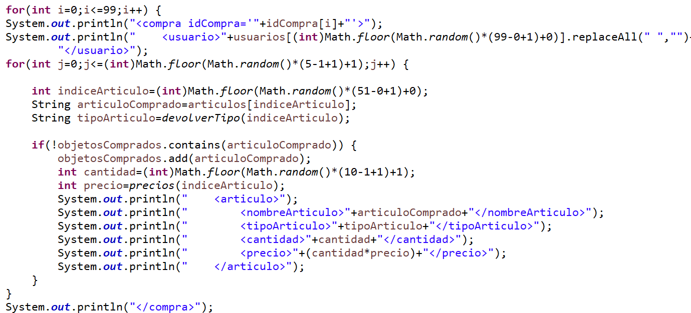

  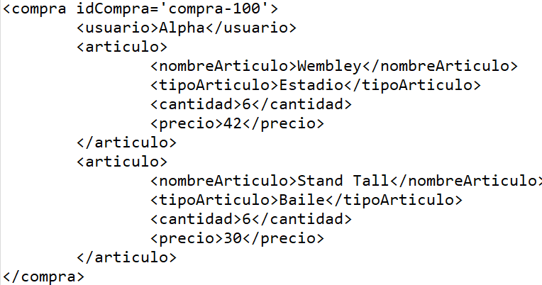

- Jugador: esté java generará los elementos del documento jugador,
  contamos con tres métodos auxiliares: *generarUsuarios* (leemos de un
  fichero los nombres de todos los usuarios del juego y los copiamos a
  un array), *generarClubes* (leemos de un fichero los nombres de los
  clubes que son formados por usuarios del juego) y *generarCuentas*
  (leemos los nombres de las cuentas de Origin de los usuarios de un
  fichero y copiamos a un array), no ponemos su código ya que es igual a
  los vistos anteriormente solo cambia el nombre del fichero de donde
  leemos.

  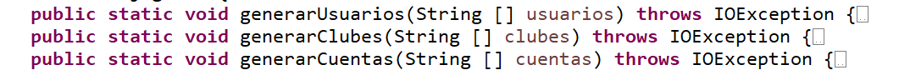

  Dentro del main tenemos el código para generar todos los elementos,
  podemos ver que dentro del for tenemos dos ifs que generan un número
  aleatorio, lo que hace es determinar si ese usuario pertenece a algún
  club y si tiene creada cuenta origin, ya que estas dos cosas son
  opcionales, lo hacemos para que el documento parezca algo más
  realista, y poder hacer consultas como ver qué usuarios pertenecen a
  un club…

  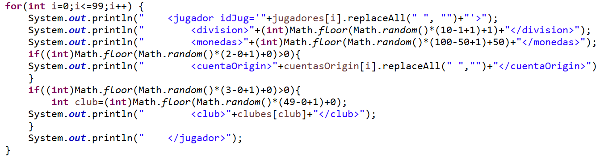

  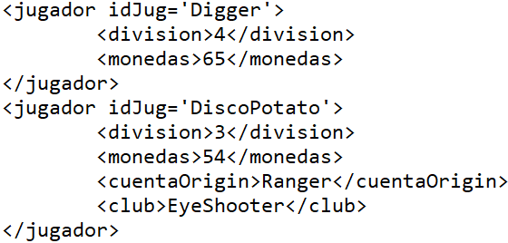

- Futbolistas: genera los elementos para el documento futbolista, como
  funciones auxiliares: *generarId* donde generamos los identificador
  únicos de cada futbolista cumpliendo con la estructura del xsd
  futbolista-\[0-9\]\[0-9\]\[0-9\], *generarFutbolista* donde leemos del
  fichero el nombre de todos los futbolistas y los guardamos en un
  array, *generarEquipos* donde leemos el nombre de los equipos
  presentes en el juego y los guardamos en un array.

  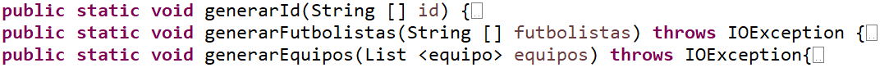

  En el main generamos todos los elementos del documentos, donde podemos
  resaltar el uso de la variable de *aux11*, donde su función es que
  cada 11 jugadores indicar que se debe cambiar de equipo, ya que hemos
  construido los ficheros de texto de *futbolistas* de manera que los
  primeros 11 jugadores pertenezcan al primer equipo del fichero de
  texto de *equiposJ,* lo hacemos para que la base de datos tenga
  jugadores reales del FIFA y pertenezcan a su equipo real. También
  tenemos una variable auxiliar llamada *numCartas,* que determina el
  número de cartas especiales que va a tener el jugador, todo jugador
  siempre tiene una carta normal, y luego puede tener una carta TOTY
  (que le suma 8 a la media de su carta normal), Destacados (que le suma
  4 a la media de su carta normal), ambas a la vez o ninguna de ellas.
  Con esto logramos que la base de datos sea más realista y podamos
  hacer más consultas, como ver que jugadores tienen x tipo de carta...

  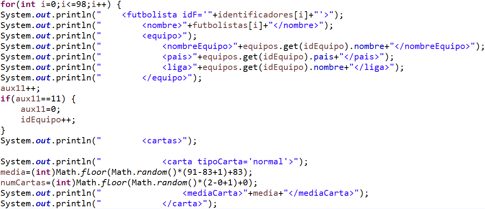

  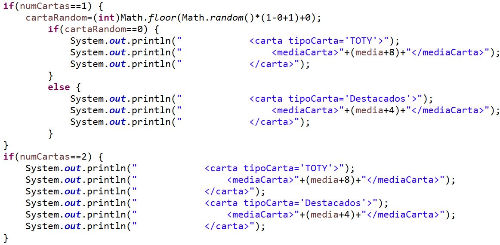

  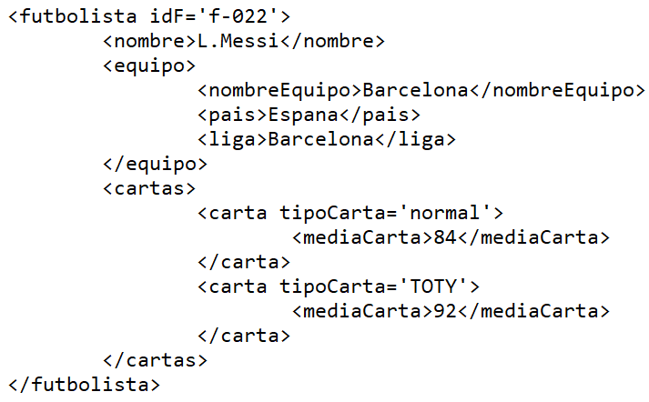

- Partidos: este java genera los elementos del documento partidos y
  jugadas, lo hicimos porque estos documentos comparten tanto los
  jugadores y equipos que juegan un partido, como los datos se generan
  de manera aleatoria así los podemos introducir directamente en ambos
  documentos, y no tener que copiar todo los jugadores y equipos de cada
  partido en un fichero y luego leerlos.

  Los métodos auxiliares son: *generarIdPartidos* (genera el
  identificador único de cada partido cumpliendo al estructura del xsd,
  partido-\[0-9\]\[0-9\]\[0-9\], este identificador se usa tanto en el
  documento jugadas como partidos), *generarUsuarios* (leemos de un
  fichero todos los usuarios del juego y los copiamos a un array,
  también los usamos en ambos documentos), *generarEquipos* (leemos de
  un fichero todos los equipos disponibles del juego y copiamos a un
  array, también lo usan ambos documentos), *generarFutbolistas* (leemos
  de un fichero todos los futbolistas del juego y copiamos a un array,
  sólo lo usaremos en el documento de jugadas), *generarSalas*
  (generemos todas las salas disponibles en el juego, solo las usamos en
  el documento de partidos).

  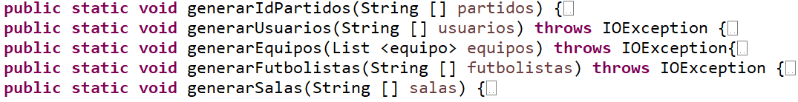

La primera parte del código genera los elementos del documentos del
partidos, aquí implementamos una restricción que no era posible en
  xsd, que es evitar que un jugador puede jugar contra el mismo, ya que
  como podemos ver en el segundo for se va a repetir de manera
  indefinida hasta que no tengamos dos jugadores distintos para disputar
  el partido. En la salida el primer jugador jugó el partido usando el
  primer equipo y el segundo jugador el segundo equipo.

  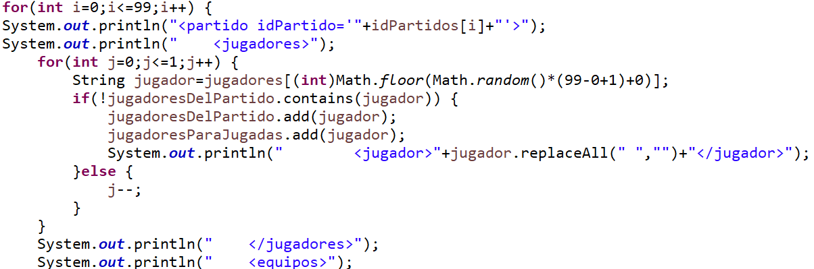

  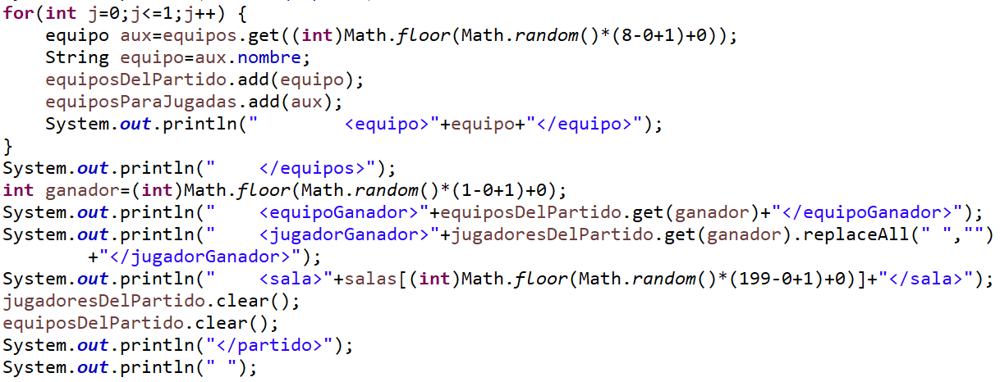

  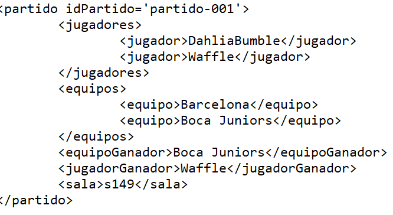

  La segunda parte del código generará los elementos del documento
  jugadas, la parte más destacable es la generación de los eventos, un
  partido puede llegar a tener de de 0 a 4 acciones destacadas, además
  cuando se da una ocasión de gol debido a como tenemos construido los
  ficheros de texto de futbolistas y equipos usando el indice del
  equipo, podemos obtener a los futbolistas de ese equipo, y entonces ya
  elegimos de manera aleatoria entre los jugadores del equipo, así
  conseguimos que los elementos generados sean bastante realistas
  (ocurre lo mismo con el evento tarjeta y al futbolista que se le saca
  la tarjeta). También llevamos la cuenta de los minutos en los que
  sucede cada evento para que el siguiente evento siempre suceda después
  del anterior.

  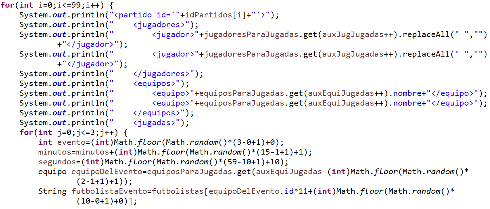

  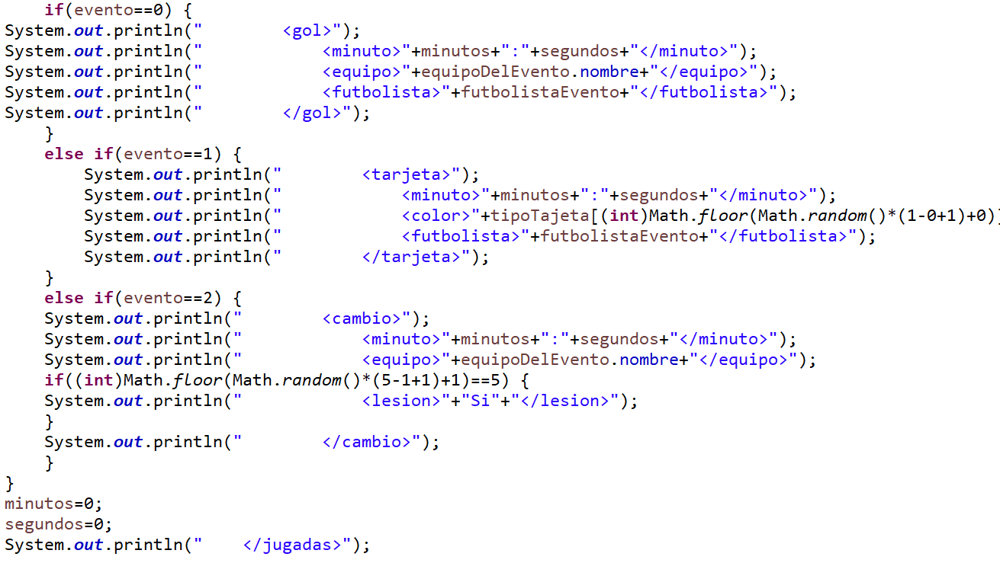

  

#

3.  **Validación de documentos.**

En este apartado se van a crear los documentos de validación XSD
relacionados con sus respectivos XML, para comprobar que los xml
cumplen con la estructura de los xsd, todos los XML tienen una
referencia a su xsd correspondiente.

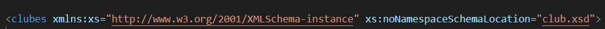

Para ello, empezamos creando los siguientes documentos XSD:

- El documento servidor que irá relacionado con su correspondiente
  documento XML servidor. En este documento se ha creado un espacio de
  nombre “xs” y se han ido creando los distintos elementos que ya
  estaban definidos en el XML. El primer elemento es “servidores”. Este
  elemento, como se puede observar en el primer punto tiene un hijo por
  lo que se tendrá que definir como un ‘complexType’ (porque es un
  elemento complejo) y luego asignarle un ‘sequence’.

  Posteriormente, se definirá su elemento hijo “servidor”. A este
  elemento se le asigna un número de ocurrencias ‘indefinida’ ya que se
  pueden crear un número ilimitado de servidores. Se volverá a definir
  como ‘complexType’ ya que tiene dos elementos hijos y luego se pondrá
  ‘sequence’ ya que se quiere que el orden de los hijos sea siempre el
  mismo.

  Para los elementos hijos, al ser nodos hoja se definirá también su
  tipo. El primero será “Región” que será de tipo String y solo se podrá
  definir una única vez de manera obligatoria (mediante minOccurs y
  maxOccurs). El segundo hijo será de tipo complejo porque a su vez
  tiene otro hijo, se tendrá que definir una única vez y será complejo.
  El último elemento hijo será “sala” la cual será de tipo ID (no se
  puede repetir el ID) y tendrá un mínimo de 1 aparición y un máximo de
  5 (cada servidor puede tener 5 salas).

  Por último definimos el atributo perteneciente al nodo “servidor” que
  será un id, el cual su uso será requerido y con una restricción la
  cual obliga a escribir este id de una manera determinada (ej: sv-000).

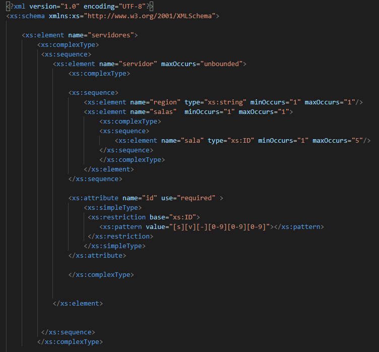

- El segundo documento será “compras”. En este documento se va a validar
  el XML compras. Para ello se define el nodo raíz “compras” que será de
  tipo complejo.

  Su nodo hijo será “compra” con un número de apariciones ilimitado.
  Este nodo será de tipo complejo también ya que posee dos hijos. Se
  definirá ‘sequence’ ya que se quiere que el orden de creación de los
  nodos hijos sea siempre el mismo.

  El primer nodo hijo será “usuario” que servirá para identificar qué
  usuario ha realizado la compra, su aparición se limitará en una y será
  obligatoria, y su tipo será un String.

  El segundo nodo hijo “artículo” será de tipo complejo ya que está
  formado por varios nodos hoja. Su aparición será, mínimo una y de
  manera ilimitada.

  Sus nodos hoja serán “nombreArticulo” y “tipoArticulo” ambos de tipo
  String y de aparición limitada en uno y de manera obligatoria. Los
  últimos dos, “cantidad” y “precio”, serán de tipo INT y su aparición
  se verá limitada en una y serán también obligatorios.

  Por último, se define el atributo del elemento “compra” que como en el
  caso anterior será un “idCompra” que tendrá una restricción la cual
  obliga a escribir este id de una manera concreta (ej: compra-000).

  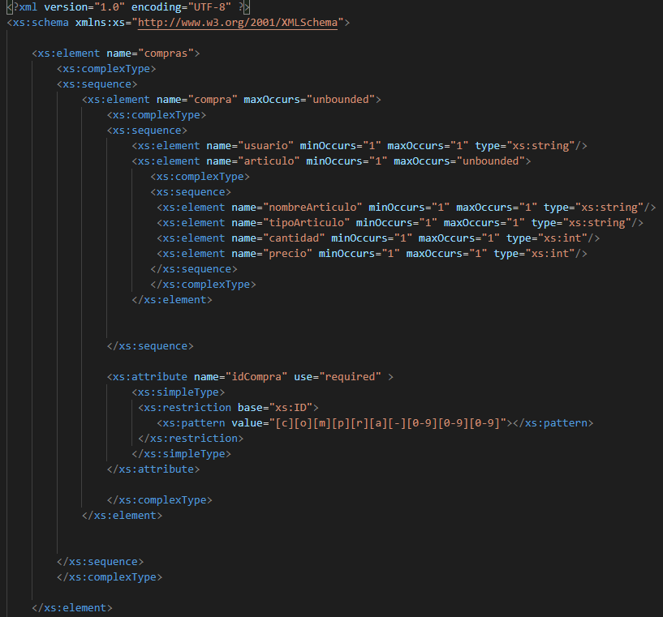

- El tercer documento será “jugador” que validará su respectivo
  documento XML jugador.

  Primero se define el nodo raíz “jugadores” de tipo complejo. Su nodo
  hijo será “jugador” que tendrá un número de apariciones ilimitado y el
  cual será de tipo complejo también con el ‘sequence’ para que los
  hijos se definan siempre en el mismo orden.

  El primer hijo será “división” que hace referencia a la división a la
  que pertenece este jugador dentro del juego. Será de tipo string y sus
  apariciones serán mínimo 1 y máximo 1.

  El segundo hijo será “monedas” que hace referencia a la cantidad de
  moneda que tiene este jugador dentro del juego. Será de tipo int y sus
  apariciones serán mínimo 1 y máximo 1.

  El tercer hijo será “cuentaOrigin” que hace referencia a la posible
  cuenta que puede tener el jugador asociada. Será de tipo ID (ya que
  las cuentas son únicas y no pueden repetirse) y sus apariciones serán
  mínimo 0 y máximo 1 por lo que no será obligatorio.

  El cuarto hijo será “club” que hace referencia al club al que el
  jugador pertenece. Será de tipo string y sus apariciones serán mínimo
  0 y máximo 1 por lo que no será obligatorio pertenecer a un club.

  Por último, se define el atributo del nodo “jugador” que será un id de
  jugador que será obligatorio y será de tipo ID para que no puedan
  existir dos jugadores con el mismo id.

  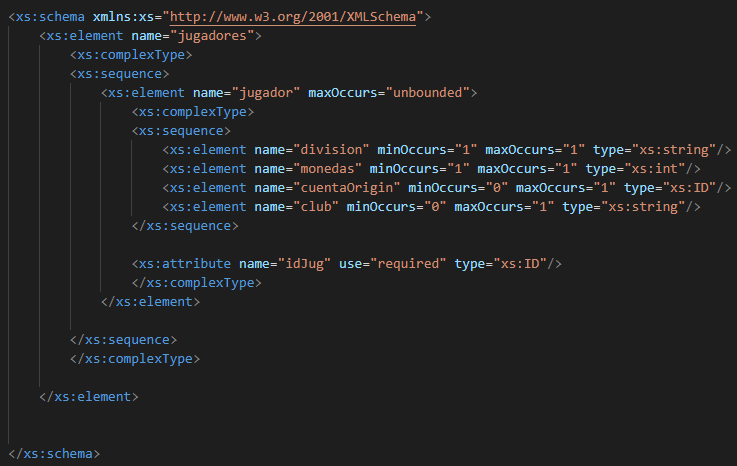

- El siguiente documento será Club. Como siempre, se define el nodo raíz
  “clubes” de tipo complejo. Su elemento hijo “club” será también de
  tipo complejo ya que está formado por un elemento hijo.

  El elemento hijo será “trofeos” que referencia a los trofeos
  conseguidos por cada club. Este elemento será de tipo complejo y
  estará formado por dos atributos ya que solo se quiere aportar
  información del trofeo. Esta información va a ser la “edición” (año)
  en el que se ha conseguido el trofeo y el “nombreTrofeo”. Ambos de
  tipo string y de manera obligatoria.

  Por último, se define el atributo que pertenece al elemento “club”.
  Este atributo será el nombre del club, que será de tipo id ya que no
  pueden existir dos clubes con el mismo nombre y será obligatorio. Al
  final del documento hemos definido una restricción del tipo llave
  (*xs:key*), se está encargando de acceder cada elemento trofeo
  (*xs:selector xpath=...*) y ver que su año del trofeo ganado y el
  trofeo son únicos (*xs:field=...*), con esta restricción logramos que
  no pueda haber dos equipos que han ganado el mismo trofeo en el mismo
  año.

  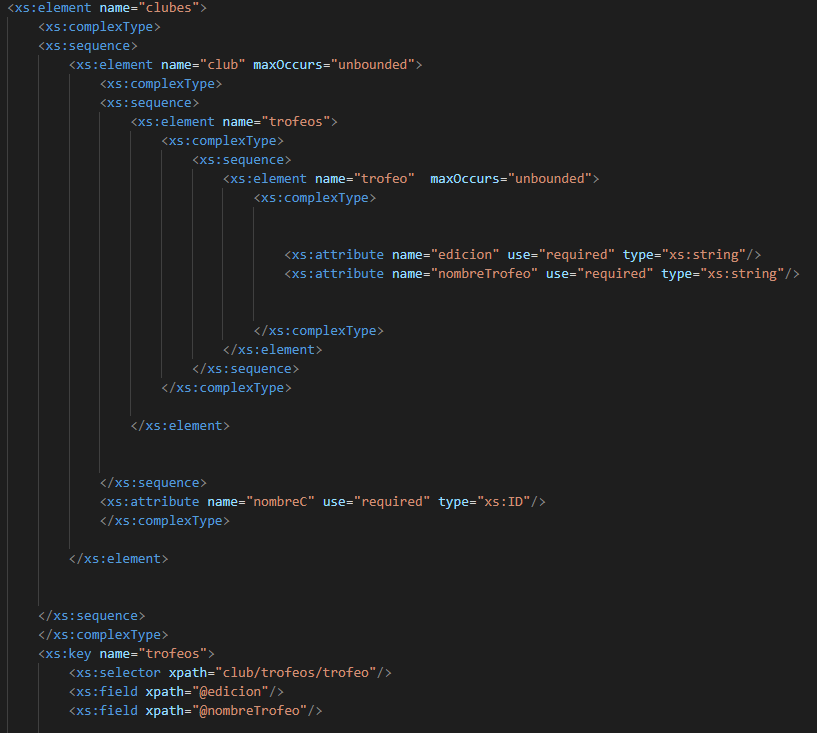

- El siguiente documento será “futbolistas”. Se empezará definiendo el
  nodo raíz “futbolistas” que será de tipo complejo. Su único elemento
  hijo será “futbolista” que podrá definirse de manera ilimitada, será
  de tipo complejo también y tendrá un ‘sequence’ ya que sus hijos
  tienen que definirse siempre en el mismo orden.

  El primer hijo será “nombre” que será el nombre del futbolista. Será
  de tipo string, con una aparición obligatoria y limitada a uno.

  El segundo hijo será “equipo” que hace referencia al equipo al que
  pertenece este futbolista. Será un elemento complejo y será
  obligatorio aunque se puede repetir dos veces (equipo y selección).
  Dentro del equipo tendremos el elemento “nombreEquipo” que será el
  nombre de este equipo. El siguiente elemento será “país” que será el
  país del equipo y el último será “liga” que referencia a la liga a la
  que pertenece el equipo. Todos de tipo String y solo se podrán definir
  una vez y serán obligatorios.

  El tercer hijo será “cartas” solo se podrá definir una vez y será
  obligatorio. También será de tipo complejo y su elemento hijo será
  “carta” que se podrá definir de manera ilimitada pero como mínimo una
  vez. Este será otro elemento complejo ya que dentro se definirá la
  media de la carta (cada futbolista puede tener distintas cartas en
  función de los partidos que haga, la temporada que haga…). El elemento
  media carta será de tipo media (restricción definida como un entero
  positivo del 1 al 99 incluidos ya que las cartas no pueden superar
  esas medias) y con una aparición limitada en uno y obligatoria. Y por
  último se define el atributo “tipoCarta” que será de tipo string y
  obligatorio para saber que tipo de carta es la que se define.

  Para finalizar, se define el atributo del nodo “futbolista” que será
  un id para identificar a este futbolista que tendrá una restricción la
  cual obliga a escribir este id de una manera concreta (ej: f-000).

  

  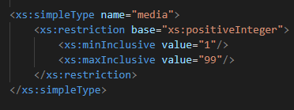

- El siguiente documento será “jugadas”. Se define su elemento raíz que
  será “partidos” (Este documento será parecido al de partidos ya que en
  nuestro juego las jugadas se producen dentro de partidos). “Partidos”
  será de tipo complejo y estará formado por el elemento “partido”. Este
  elemento será complejo y estará formado por “jugadores” y “equipos”,
  ambos de tipo complejo formados por los elementos “jugador” y “equipo”
  respectivamente. Los dos se tendrán que repetir dos veces como mínimo
  y máximo (un partido es jugado por dos jugadores con dos equipos).

  El tercer elemento será “jugadas”. Será un elemento ‘choice’ el cual
  puede ocurrir de manera ilimitada e incluso no producirse. Será
  complejo también ya que estará formado por tres elementos distintos
  “gol”, “tarjeta” y “cambio”.

  El primer elemento “gol” será complejo y de tipo ‘sequence’. En él se
  tendrá que definir el minuto que será de tipo string y con aparición
  de 1\|1. El siguiente será el “equipo” que ha marcado el gol que será
  también 1\|1. El “futbolista” que ha marcado el gol que tendrá la
  misma aparición (1\|1) y por último el “tipo” de gol. Este último no
  será obligatorio ya que si se pone este elemento será para indicar
  únicamente si ha sido un gol “especial”, es decir de penalti o en
  propia puerta. Esto está controlado con una restricción para que
  únicamente existan estas dos opciones si se decide poner este
  elemento.

  El elemento tarjeta será de tipo complejo y estará formada por los
  elementos “minuto”, de tipo string y de ocurrencia 1\|1. El “color” de
  la tarjeta que será 1\|1 también y estará limitado por una restricción
  en la cual solo podremos decidir entre amarilla y roja (las únicas
  tarjetas posibles en el juego) y el último elemento que será el
  “futbolista” al que se le muestra esta tarjeta que será también 1\|1.

  El último elemento de “jugadas” será “cambio”. Este elemento estará
  formado por el “minuto” en el que se realiza el cambio, que será de
  tipo string y con una aparición de 1\|1, el “equipo” en el que se
  realiza el cambio que será también 1\|1 y por último, de manera
  excepcional (no obligatorio), si el cambio es por lesión. Esto se
  controlará con una restricción en la que el único valor posible será
  “sí” ya que únicamente se pondrá este elemento si es una lesión.

  Por último se define el atributo perteneciente al nodo “partido” que
  será un id para identificar el partido que tendrá una restricción la
  cual obliga a escribir este id de una manera concreta (ej: partido-000).

  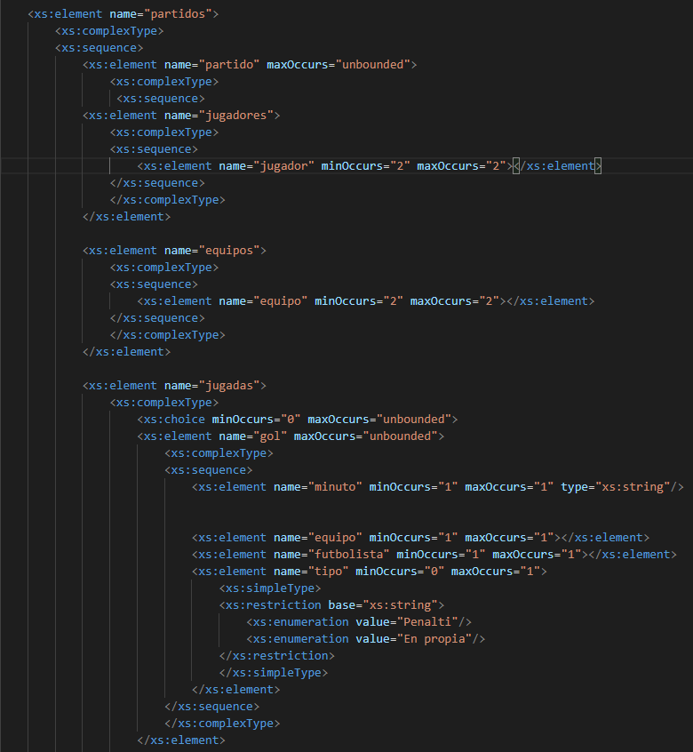

  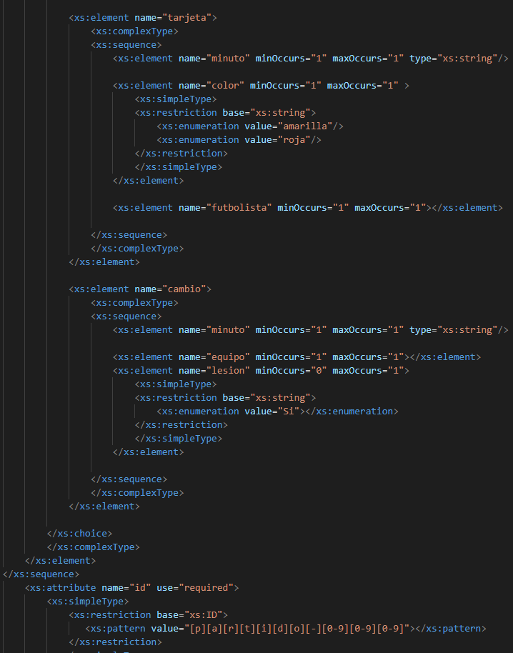

- El último documento será el de “partidos”. Se define su elemento raíz
  que será “partidos”. Será de tipo complejo y estará formado por el
  elemento “partido”. Este elemento, también será complejo y estará
  formado por “jugadores” y “equipos” ambos de tipo complejo formados
  por los elementos “jugador” y “equipo” respectivamente. Los dos se
  tendrán que repetir dos veces como mínimo y máximo (un partido es
  jugado por dos jugadores con dos equipos).

  También tendrá un elemento que será “equipoGanador” que referencia al
  equipo que se lleva la victoria en el encuentro, el “jugadorGanador”
  que será el jugador que gana y por último la “sala” en la que se juega
  el partido, todos ellos con una ocurrencia 1\|1. Todos los elementos
  serán de tipo String.

  Por último se define el atributo perteneciente al nodo “partido” que
  será un id para identificar el partido que tendrá una restricción la
  cual obliga a escribir este id de una manera concreta (ej:
  partido-000).

  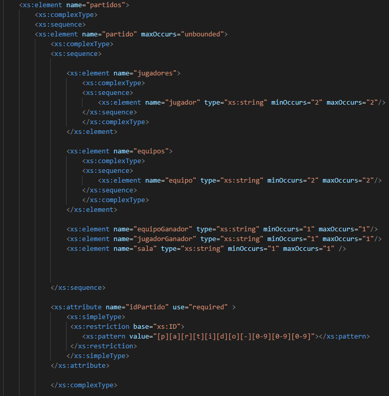

#

**4. Diseño de operaciones FLOWR**

Una vez creados los documentos XML que simularían la base de datos del
FIFA 2020, habiendo añadido elementos a cada uno de ellos y habiendo
validado estos con su respectivos documentos XSD se procede a realizar
diferentes consultas sobre la base de datos que nos permitirán recoger
información importante y de utilidad.

<u>Primera consulta (filtrado por una sola condición):</u>

1.  Cada semana después de que todos los equipos hayan jugado sus
    partidos correspondientes en la vida real, el FIFA modifica en
    cierta medida la valoración de cada jugador en función de cómo lo ha
    jugado en la jornada. Si un equipo ha jugado bien y ha ganado se le
    sube la media a sus jugadores, en cambio si ha perdido se le baja.

    

    Esta consulta nos permite obtener el nombre de todos los jugadores del
    equipo para poder aplicar estas modificaciones:

    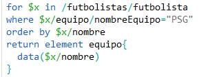

    Se recorre el documento futbolistas con un for. La variable x evalúa
    cada nodo futbolista y comprueba que el elemento nombreEquipo propio
    del equipo al que pertenece el futbolista sea PSG. Los nombres
    obtenidos se ordenan ascendentemente y se devuelve cada uno dentro de
    un elemento equipo donde data nos permite mostrarlos con la etiqueta
    correspondiente al elemento.

    Resultado:

    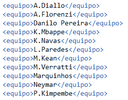

2.  A la hora de conectarse a un servidor para jugar partidos online
    tenemos que detectar qué servidor tenemos más cerca. En el caso de
    España, al no tener nuestro propio servidor los jugadores tendrán
    que conectarse al más cercano posible, en este caso Italia. Para
    ello, se realizará una consulta en la que se muestre el servidor de
    Italia y cuántas salas tiene disponibles para saber si la conexión
    va a ser buena o mala.

    La consulta es la siguiente:

    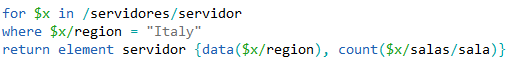

    El resultado será:

    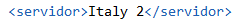

<u>Segunda consulta (filtrado por varias condiciones):</u>

En el FIFA se realizan competiciones semanales para poder subir de
división y aumentar así la cantidad de recompensas que obtienes al final
de cada una. Además de estas recompensas, si el jugador tiene una cuenta
Origin podrá recibir una cantidad de monedas adicional en función de la
división que ha conseguido alcanzar. Con esto los desarrolladores
quieren fomentar la creación de cuentas Origin.

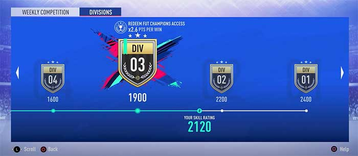

Esta consulta nos permite obtener los usuarios que se encuentran en la
primera división y que además tienen cuenta Origin para poder otorgarles
las monedas correspondientes:

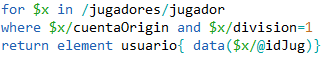

Se recorre el documento jugadores con un for. La variable x evalúa cada
nodo jugador y comprueba que este tiene una cuenta Origin y que la
división a la que pertenece sea la 1. Los ids de los jugadores obtenidos
se devuelve cada uno dentro de un elemento usuario donde data nos
permite mostrarlos con la etiqueta correspondiente al elemento.

Resultado:

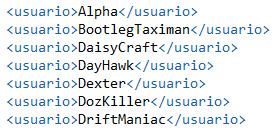

<u>Tercera consulta (ordenación):</u>

1.  Es habitual que cada cierto tiempo los desarrolladores incluyan
    objetos nuevos en la tienda para fomentar el uso de monedas y
    motivar así a los jugadores a ganarlas jugando más. Es importante
    reunir información sobre cuáles son los productos están teniendo
    éxito para decidir si en ocasiones futuras se incluye un nuevo
    artículo de un tipo en concreto en función de lo que quieran
    reactivar el mercado.

    Esta consulta nos ofrece el nombre de los artículos que están
    disponibles en la tienda ordenados por la cantidad de estos que se ha
    comprado de mayor a menor:

    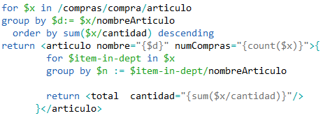

    Se recorre el documento compras con un for. La variable x evalúa cada
    elemento artículo (contenido en cada nodo compra), agrupa estos por su
    nombre y los ordena descendentemente por la cantidad de veces que se
    ha vendido cada uno, la cual se obtendrá con una subconsulta que por
    cada artículo que tenga el mismo nombre guardará la cantidad de veces
    que se ha vendido y la irá sumando para obtener la cifra total. Por
    ejemplo el artículo Rematador aparece en 11 compras diferentes, en la
    compra 1 se ha comprado tres veces, en la 2 cuatro veces y así hasta
    11 compras. La subconsulta suma cuántas veces se ha comprado ese
    artículo en cada compra. Finalmente la consulta devuelve un elemento
    artículo con su nombre y el número de compras en el que aparece y a la
    vez en su interior un elemento total con la cantidad final de veces
    que se ha comprado cada artículo.

    Resultado:

    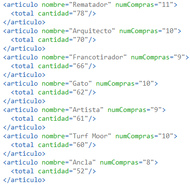

2.  A la hora de seleccionar un equipo para jugar con él, dentro del
    FIFA se ordenan por el país y luego por la liga a la que pertenecen.

    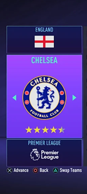

    Como se puede ver en la anterior imagen, los equipos están ordenador
    arriba por el país y debajo por la liga a la que pertenecen. Se quiere
    realizar lo mismo en nuestra base de datos para que el jugador pueda
    elegir equipo de manera más sencilla.

    La consulta sería:

    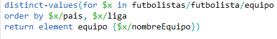

    Esta consulta lo que hace es sacar todos los equipos (sin repetirlos)
    presentes en la base de datos y ordenarlos primero por el país y
    segundo por la liga.

    El resultado sería:

    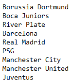

    Como se puede ver, los equipos están ordenados primero por país
    (alemania, argentina..) de manera alfabética como ocurre en el fifa y
    luego dentro del país se ordenan por liga.

<u>Cuarta consulta (función de agregación):</u>

De vez en cuando el FIFA decide premiar a los usuarios que dedican su
tiempo de juego a un tipo de partidos en concreto (por ejemplo jugar al
modo carrera, amistoso online, ultimate team, etc.) Hay un modo de juego
en el cual compites junto con el resto de miembros de tu club para ganar
torneos y por ende trofeos. Se entregarán una cantidad de monedas a los
jugadores de cada club en función del número de trofeos que tienen en
sus vitrinas.

Esta consulta proporciona el nombre de los clubes y la cantidad de
trofeos que tienen:

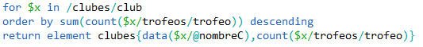

Se recorre el documento clubes con un for. La variable x evalúa cada
nodo club y cuenta el número de trofeos de cada competición que tiene el
club y los suma todos para ordenarlos descendentemente de mayor número a
menor. Los nombres de los clubes y la cantidad total de trofeos que
tienen se devuelven en un elemento clubes con su etiqueta
correspondiente proporcionada por data.

Resultado:

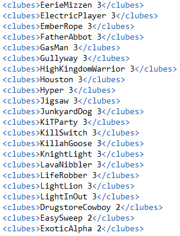

<u>Quinta consulta (operación sobre dos documentos con elementos
distintos):</u>

Como se ha explicado antes, existe un modo de juego en el FIFA donde
compites junto al resto de compañeros de tu club y en función de los
torneos que ganas y de la división en la que se encuentra tu club al
final de cada semana se entregan diversas recompensas, las cuales serán
las mismas para todos los integrantes del club.

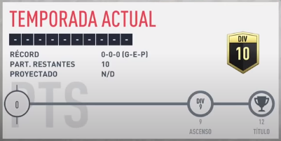

Esta consulta nos permite saber el nombre de todos los jugadores que
conforman un club para poder entregarles dichas recompensas:

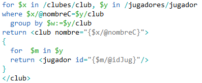

Se recorre el documento clubes y el documento jugadores con un for,
relacionados por el atributo nombre del club del primer documento y el
elemento nombre del club del segundo documento. La variable \$x evalúa
cada nodo club del primer documento y la variable \$y de cada nodo
jugador del segundo documento. Se agrupan todos los elementos por club y
la variable m recorre esos clubes y obtiene los ids de los jugadores que
pertenecen a de cada uno de ellos. Se devuelve un elemento club con el
nombre de este que a su vez en su interior contiene los elementos de los
jugadores que lo conforman, cada elemento con su respectiva etiqueta.

Resultado:

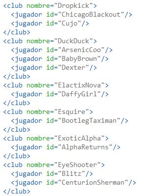

#

**5. Referencias**

Página usada para obtener los países donde se alojaría cada servidor,
usado en el documento servidores:

[<u>https://history.state.gov/countries/all</u>](https://history.state.gov/countries/all)

Página usada para obtener los nombre de los usuarios, cuentas Origin y
clubes formados por los usuarios, usado en el documento usuarios:

[<u>https://www.findnicknames.com/cool-gamer-tags/</u>](https://www.findnicknames.com/cool-gamer-tags/)

Fuente usada para copiar los nombres de los estadios, usados en el
documento compras:

[<u>https://www.goal.com/es-ar/noticias/fifa-18-todos-los-estadios-del-juego/1nezo00pn4j7i1gfud91l7822l</u>](https://www.goal.com/es-ar/noticias/fifa-18-todos-los-estadios-del-juego/1nezo00pn4j7i1gfud91l7822l)

Fuente usada para copiar los bailes disponibles en el FIFA, usados en el
documento compras :

[<u>https://www.todoultimateteam.com/catalogo-fifa-18-ultimate-team-completo/</u>](https://www.todoultimateteam.com/catalogo-fifa-18-ultimate-team-completo/)

Fuente usada para copiar las mejoras de los jugadores en el documentos
compras:
[<u>https://www.eurogamer.es/articles/fifa-21-estilos-quimica-explicados-mejores-estilos-quimica-posicion</u>](https://www.eurogamer.es/articles/fifa-21-estilos-quimica-explicados-mejores-estilos-quimica-posicion)

Fuente usada para copiar todas las copas, usado en el documento clubes:

[<u>https://www.goal.com/es/todas-las-competiciones</u>](https://www.goal.com/es/todas-las-competiciones)

Página usada para copiar los jugadores de cada club, usado en el
documento futbolistas:

[<u>https://www.fichajes.com/</u>](https://www.fichajes.com/)
