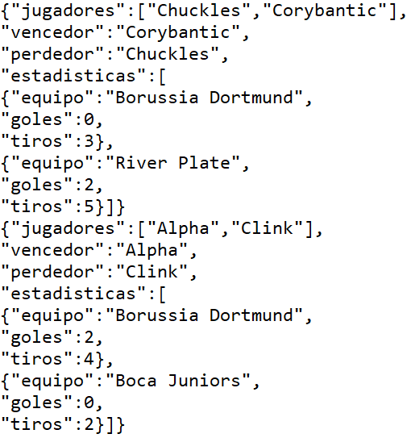
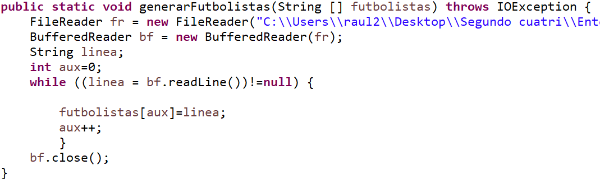
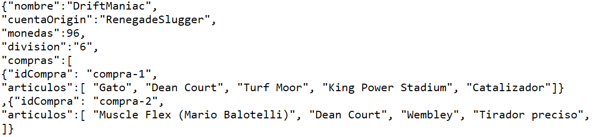
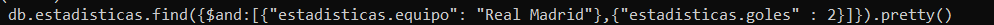

##  

**Práctica 3**

Gestión de Datos en Medios Digitales

**─**

*Raúl Fernández Ruíz*

*Aitor García Prádanos*

*Jaime Jiménez López*

*Asier Menéndez Mendoza*

#

**ÍNDICE**

1.  *Identificación de las consultas*

2.  *Colecciones y documentos propuestos*

3.  *Creación de documentos*

4.  *Diseño de operaciones CRUD*

5.  *Creación de índices*

6.  *Referencias*

#

<!-- -->

1.  **Identificación de las consultas**

<!-- -->

1.  La primera consulta que vamos a destacar es interesante desde el
    punto de vista de los desarrolladores **“saber cuántos partidos se
    han jugado en un servidor, para ver los servidores más frecuentados
    y así darles más salas”.** En un juego como el FIFA, donde su éxito
    viene de su componente multijugador, es algo crucial ofrecer un buen
    servicio online. En este caso, lo que los desarrolladores buscarían
    sería ver los servidores más frecuentados para así ofrecer más salas
    a estos servidores y reducir el tiempo de búsqueda de una sala
    disponible para jugar el partido.

2.  Desde el punto de vista de los desarrolladores es interesante
    realizar consultas del tipo **“sacar los ids de los usuarios que no
    tengan cuenta origin”.** Las empresas desarrolladoras de videojuegos
    suelen sacar cuentas especiales para sus videojuegos (en el case EA
    Games la cuenta Origin, en Epic Games la cuenta Epic....). Estas
    cuentas se usan para fines publicitarios, enviar ofertas de juegos
    de la compañía… El objetivo de estas cuentas es conseguir fidelizar
    al usuario e incitarle a comprar juegos de la compañía (ofreciendo
    ofertas, regalos...). Por lo tanto para los desarrolladores es
    interesante ver que jugadores no tienen una cuenta Origin creada y
    en caso de no tenerla ofrecerle ofertas para que se cree esta cuenta
    (monedas para comprar en la tienda del FIFA, equipaciones
    especiales...)

3.  La siguiente consulta es algo crucial para los usuarios “**que un
    jugador vea todas las compras que ha hecho**”. El FIFA es un juego
    repleto de micropagos, por ello los usuarios deben poder tener un
    historial donde puedan verlas, pedir devoluciones e incluso ver si
    se han realizado compras con su cuenta que ellos no habían
    autorizado. Este último motivo hace que este tipo de consultas
    también interesen a los desarrolladores por temas de ciberseguridad,
    robo de cuentas o datos personales…

4.  Una de las formas en la que los desarrolladores mantienen la
    atención de los usuarios en el juego y consiguen que sigan gastando
    su dinero es añadiendo artículos nuevos a la tienda cada cierto
    tiempo. Para saber que estos nuevos artículos están teniendo éxito,
    una de las consultas más habituales realizada por los
    desarrolladores es “**pedir los artículos que más veces se han
    vendido**”.

5.  Un hecho inherente del juego es que los equipos necesitan tener
    jugadores para poder poder participar en un partido. Por ello, la
    siguiente es consulta es “**consultar los jugadores que componen
    cada equipo**” puede ser sin duda una de las consultas más
    realizadas por el jugador de manera indirecta ya que se ejecuta a la
    hora de cambiar la alineación de la plantilla, de buscar un jugador
    para aplicarle una mejora o para venderlo, para cambiarle de número
    o cambiar el aspecto de este, etc.

6.  En este caso, una de las consultas más frecuentes en el juego sería
    “**ver los jugadores que cuentan con una carta especial de X
    tipo**”. Esta consulta es muy típica y es muy común por parte de los
    jugadores. A la hora de comprar un jugador para tu club se buscan
    las cartas especiales para que cuando vayas a añadirle a tu equipo
    sea la mejor carta posible de ese jugador.

    Otro punto de vista, es por parte de los desarrolladores, ya que a la
    hora de sacar los equipos de la semana o equipos del año pueden
    realizar esta consulta para saber si los jugadores que van a formar
    parte de ese equipo tienen o no tienen una carta especial ya. Si la
    tuviesen, tendrían que crear una nueva carta ‘mejor’ que la que ya
    tenía para que tuviese sentido el comprarla por parte de los
    jugadores.

7.  La siguiente consulta sería interesante tanto desde el punto de los
    desarrolladores como del de los usuarios **“ver el club con más
    trofeos ganados y sus jugadores”.** Desde el punto de vista del
    desarrollador, para dar los premios a los jugadores de los equipos
    con más victorias o a los que han ganado un determinado trofeo….
    Desde el punto de vista de los jugadores para realizar opciones de
    filtrado dentro del juego (por ejemplo estar dentro del FIFA y pedir
    que te ordene los clubs por victorias).

8.  La última consulta de nuestra base de datos es de las más
    consultadas por los jugadores. La consulta típica de “**ver las
    estadísticas del partido**”. Siempre que se está jugando un partido,
    algún jugador le da al pause para realizar cambios, mirar cualquier
    cosa… Este momento es aprovechado por todos los jugadores para
    consultar las estadísticas del partido (posesión, tiros a puerta,
    pases realizados, tarjetas…). Por todo esto se considera que esta es
    de las consultas más frecuentes dentro de la base de datos del FIFA.

<!-- -->

#

2.  **Colecciones y documentos propuestos**

- <u>Equipos</u>: esta colección recoge todos los equipos pertenecientes
  a esta base de datos del Fifa 20. Definen los diferentes equipos que
  pueden escoger los usuarios a la hora de jugar un partido. Cada uno de
  los objetos que la forman están compuestos por los siguientes
  atributos:

  - Equipo: indica el nombre del equipo.

  - Liga: indica el nombre de la Liga a la que pertenece el equipo.

  - País: indica el nombre del país donde se ubica la liga en la juega el
    equipo.

  - Jugadores: se trata de un array que contiene el nombre de los
    jugadores que componen el equipo.

    Ejemplo de objeto:

    

  El diseño de esta colección permite realizar la consulta cinco
  (consultar los jugadores que componen cada equipo). Además permitirá
  realizar otras consultas como a qué equipo pertenece cierto jugador,a
  qué país pertenece cierto equipo, a qué liga pertenece cierto equipo,
  etc.

- <u>Compras</u>: esta colección recoge la información de todas las
  compras que se han realizado en el juego. Define la acción de ir al
  apartado tienda del Fifa y comprar uno o más artículos. Cada objetos
  de esta colección está formado por los siguientes atributos:

  - Id: indica el identificador de la compra representado mediante
    "compra" más el número de compra correspondiente.

  - Usuario: indica el nickname del usuario que ha realizado la compra.

  - Artículos: array el cual está compuesto por el nombre de todos los
    artículos que el usuario ha decidido comprar.

  - Coste: indica las monedas totales que ha gastado el usuario en la
    compra.

  Ejemplo de objeto:

  

El diseño de esta colección permite realizar la consulta cuatro (pedir
los artículos que más veces se han vendido). Además permitirá realizar
otras consultas como el número total de monedas que se ha gastado cada
usuario en total, cuántas veces se ha comprado cierto artículo, sacar
todos los artículos que ha comprado un usuario y cuánta cantidad de
cada uno, etc.

- <u>Usuarios</u>: dentro de esta colección guardamos la información más
  relevante de los usuarios como:

  - Nombre: nombre del usuario

  - Cuenta Origin: nombre de la cuenta Origin del usuario

  - Monedas: sirven para comprar en la tienda

  - División: indica en qué división encuentra el jugador (en el FIFA los
    mejores jugadores se encuentran en las divisiones más bajas y los
    novatos en las altas).

  - Compras: cada elemento de la colección tendrá un array de elementos
    compra, ya que como vimos en el primer punto en la tercera consulta un
    jugador puede ver todas las compras que ha hecho, en nuestro caso para
    un jugador puede ver sus compras tendrá este array donde se reflejarán
    todas ellas (es cierto que lo podríamos haber dejado solo con la
    colección compras y haber hecho la consulta ahí, pero no tiene mucho
    sentido que cada vez que un usuario quiera ver sus compras tenga que
    filtrar entre todas las compras del juego). Si este array no existiera
    en la colección usuarios nos veríamos obligados a tener que hacer
    joins, lo cual en mongo es algo que siempre que podamos evitarlo
    mejor, debido a que es muy costoso

    

Otras consultas frecuentes que se podrían realizar: obtener a los
jugadores que han comprado un determinado artículo, obtener a los
jugadores de las divisiones más altas, obtener a los jugadores que no
disponen de una cuenta Origin....

- <u>Trofeos</u>: dentro de esta colección guardamos todos los clubes
  formados por usuarios del juego con la siguiente información:

  - Nombre del club: nombre del club formado por usuarios

  - Miembros: muestra los usuarios que forman ese equipo

  - Trofeos: array de objetos donde cada elemento tiene el nombre del
    trofeo y año en el que lo ganó ese club.

Como vemos el diseño de esta colección nos permitiría realizar la
consulta siete del primer punto (ver el club con más trofeos ganados y
sus jugadores),además evitamos joins con la colección usuarios al
tener un array que refleje a los usuarios del club, nos permitiría
realizar otras consultas frecuentes cómo: ver los jugadores que
pertenecen a X club, obtener los clubes que han ganado un determinado
trofeo….

- <u>Servidores</u>: esta colección refleja los servidores de los que
  dispone la empresa:

  - Id: identificador del servidor

  - Continente al que pertenece el servidor

  - Partidos: array que nos indica los partidos que se han jugado en ese
    servidor

  - Salas: array que indica el número de salas que tiene ese servidor (en
    las salas es donde se juegan los partidos online)

El diseño de esta colección cumple con la primera consulta del punto
anterior (saber cuántos partidos se han jugado en un servidor, para
ver los servidores más frecuentados y así darles más salas), pero
también nos permitiría realizar otras consultas frecuentes como ver en
qué servidor se jugó un determinado partido,el servidor menos
frecuentado (el que menos partidos tenga)...

- <u>Futbolistas</u>: esta colección guarda toda la información de los
  futbolistas dentro del juego. Esta información será:

  - Id: guardará un id de futbolista que lo diferenciará del resto.

  - Nombre: guardará el nombre del futbolista en concreto.

  - Edad: guardará la edad del futbolista en concreto.

  - Cartas: este elemento será un array de JSONS donde guardaremos los
    tipos de carta que tiene el futbolista. En cada objeto definiremos
    tanto el tipo de la carta como la media que tiene el jugador en esa
    carta.

  

El diseño de esta consulta cumple perfectamente con la consulta
frecuente del apartado anterior donde se especificaba que una de las
consultas más frecuentes del juego era “Ver si un jugador tiene X tipo
de carta especial”. Esta consulta está cubierta ya que se guardan
estos tipos de carta en un array el cual se puede consultar para sacar
cualquier tipo en concreto.

También permitirá la realización de otro tipo de consultas frecuentes
como sácame el nombre de X jugador o sácame la edad de X jugador (esta
consulta se usa mucho también por que a la hora de crear un tipo de
carta determinado (ej:jóvenes promesas) se necesita conocer la edad
para que cumplan ciertos requisitos para tener esta carta).

- <u>Estadísticas</u>: esta colección guardará todas las estadísticas
  del partido para que se puedan consultar durante el partido o
  posteriormente. Esta colección contiene:

  - Jugadores: nombre de los jugadores que están jugando ese partido.

  - Vencedor: el nombre del jugador que ha ganado ese partido.

  - Perdedor: el nombre del jugador que ha perdido ese partido.

  - Estadísticas: array de objetos JSONS donde se guardan las estadísticas
    principales del partido.

  

Como se puede ver, la consulta ha sido diseñada para cubrir
perfectamente la consulta más frecuente que es “Ver la estadísticas
del partido”. Se ha creado un array “Estadísticas” en el cual se
guarda toda la información necesaria para cubrir esta consulta.

También esta colección ha sido diseñada para poder responder otras
consultas frecuentes como cuál ha sido el ganador de X partido (para
darle alguna recompensa por número de victorias), cuántos partidos ha
jugado X jugador (para llevar un historial de partidos totales) y esto
también se podría combinar con el vencedor y perdedor para poder tener
un historial de partidos de partidos jugados, victorias, derrotas…

#

3.  **Creación de documentos**

Para la generación de los documentos hemos usado el entorno Eclipse y
el lenguaje de programación Java. Generamos los documentos con la
estructura de documentos java, y posteriormente usaremos la opción de
mongo para importar documentos json y añadirlos a nuestra base de
datos.

- <u>Colección estadísticas</u>: primero usamos dos métodos auxiliares,
  generarUsuarios que nos proporcionará los nombres de los usuarios y
  generarEquipos, que nos dará los nombres de los equipos. Para ello
  ambos métodos leerán de un fichero los nombres de los jugadores y
  equipos para tratar de hacerlo lo más automatizado posible.

  

  Dentro del main pasaremos a generar todos los elementos de la
  colección cumpliendo con la estructura de un json. Esta primera parte
  del código la usamos para definir los jugadores que disputarán el
  partido, además el bucle se ejecutará hasta que tengamos dos jugadores
  distintos para disputar el partido, ya que no sería lógico que un
  jugador jugara contra él mismo. Podemos ver en varias partes la
  sintaxis \\, esto lo hacemos para poder mostrar los elementos entre
  comillas al imprimir por pantalla, ya que si no lo hiciéramos nuestro
  documento json tendría errores de sintaxis, y mongo no nos dejaría
  importarlo.

  

  A continuación generamos un número aleatorio para determinar al
  ganador del partido, dependiendo de qué equipo gane controlamos que
  ese equipo sea el que más goles ha metido.

  

  

  Por último generamos todos los elementos, otro aspecto de usar java es
  que usando los print de manera correcta podemos obtener una salidas
  fáciles de interpretar y detectar errores rápidamente.

  

- <u>Colección trofeos</u>: también usamos tres métodos auxiliares para
  generar parte de los datos leyendo de un fichero, generarUsarios para
  generar los nombres de los miembros del club. GenerarClubes, para
  obtener los nombres de los clubes formados por usuarios del juego y
  auxTrofeos, el cual usa una clase auxiliares que definimos para
  facilitar la generación de elementos, donde un elemento de esta clase
  almacena nombre del trofeo y año en el que se ganó, por cada trofeo
  generamos 5 ediciones distintas comprendidas entre 2016 y 2021, un
  trofeo de un año determinado puede pertenecer a un único equipo.

  

  

  Ahora ya pasamos al main para generar los datos, primero definimos el
  nombre del club y los miembros que tendrá de manera aleatoria (entre 4
  y 2), podemos ver como cada vez que añadimos un jugador hacemos un
  jugadores.remove(...), esto lo hacemos para evitar que una vez añadido
  un jugador a un club se pueda añadir a otro.

  

  Para lo trofeos del club seguimos una idea muy parecida, definimos de
  manera aleatoria el número de trofeos del club (entre 1 y 3), y una
  añadido una trofeo (dentro del código el elemento trofeo contiene el
  nombre del trofeo y año que se ganó), lo eliminamos de la lista de
  candidatos para que no se repita.

  

  Por último ejecutamos y obtenemos todos los elementos:

  

- <u>Colección futbolistas</u>: primero tenemos dos métodos auxiliares
  para generar el identificador único de cada futbolista (ya que usar el
  nombre podría dar problemas si dos futbolistas se llamaran igual) y
  leer los nombres de los futbolistas de un fichero.

  

  Dentro del main pasamos a definir cómo serán los elementos, indicamos
  el identificador, nombre y edad del futbolista. A continuación pasamos
  a definir su carta base (recordar que dentro del FIFA los jugadores
  pueden tener diferentes tipos de cartas que mejoran diferentes
  atributos, pero siempre como mínimo van a tener una carta, que será su
  carta estándar sin ningún tipo de mejora).

  

  Generamos unos números aleatorios para determinar si el jugador tiene
  cartas especiales y de qué tipo, se pueden dar tres situaciones: no
  tener cartas especiales, tener una carta TOTY (la mejor carta del
  juego, se obtiene si el jugador está dentro del equipo del año del
  FIFA o carta Destacados, para jugadores que han hecho una gran
  temporada) y tener ambas cartas especiales.

  

  Por último generamos los elementos.

  

- <u>Colección equipos</u>: tenemos dos métodos auxiliares para generar
  los datos, generarFutbolistas para leer el nombre de los futbolistas
  de un fichero y generarEquipos, donde leemos del fichero el nombre,
  liga y división del equipo, para almacenar estos tres datos hemos
  creado una clase auxiliar para ello y que sean más fáciles de manejar.

  

  

  Pasamos al main para definir los elementos de la colección, donde
  indicamos el nombre del equipo, liga, país y los 11 jugadores
  titulares del equipo. Tenemos ordenados los datos en los ficheros para
  que los jugadores coincidan con sus equipos de la realidad y no se
  asignen de manera aleatoria.

  

  Generamos los elementos.

  

- <u>Colección compras y usuarios</u>: estas dos colecciones las
  generamos en el mismo .java, lo hicimos porque queríamos que la
  compras que había realizado un usuario en la colección compras
  coincidiera con las compras que había hecho en la colección usuarios
  (más adelante veremos cómo hecho hecho esto), nos era fácil más
  generar estas dos colecciones a la vez a tener que copiar todas las
  compras en un txt, ver a qué usuario pertenece….

  Tenemos varios métodos auxiliares para generar los nombres de los
  usuarios, artículos, cuentas Origin de un txt, y otros para generar
  los identificadores de las compras o devolver el precio de una
  artículo. También creamos una clase auxiliar para guardar los datos
  más importantes de la compra y luego usarlos en la colección usuarios.

  

  

  La primera parte generará los elementos del documento de compras,
  donde estamos generando el identificador de la compra y nombre del
  usuario que la ha realizado, y podemos ver como hacemos
  auxiliar.nombre=usuario para ir guardando los datos más importantes de
  la compra.

  

  A continuación generemos los artículos comprados en la compra de
  manera aleatoria, donde podemos ver cómo seguimos almacenando los
  datos más importantes de la compra, y al terminar los añadimos a una
  lista compras, que contendrá los elementos más importantes de cada
  compra realizada (nombre del usuario y artículos comprados) que
  usaremos en la colección usuarios.

  

  Ahora pasamos a ver el código para generar los usuarios, definimos los
  nombres de los usuarios, cuentaOrigin, monedas, división y compras.
  Tenemos un for interno donde recorreremos la lista donde se han
  almacenado las compras de los jugadores, si encontramos una compra con
  su nombre, lo añadimos a su array de compras (si no ha realizado
  compras tendrá el array vacío).

  

  Pasamos a generar los elementos y ver cómo coinciden las compras de
  los usuarios en una colección y en otra. En este caso en la colección
  compra podemos ver cómo el usuario DriftManiac ha hecho dos compras.

  

  

  En la colección usuarios podemos ver reflejadas ambas compras.

  

- <u>Colección servidor</u>**:** usamos algunos métodos auxiliares para
  generar los identificadores de los partidos, salas y servidores,
  también leemos de un fichero los continentes donde se ubicaran los
  servidores.

  

  En el main generamos los documentos, primero definimos identificadores
  del servidor y continente donde se ubicará. Con un número aleatorio
  determinamos cuántos partidos se han disputado en ese servidor (entre
  1 y 3).

  

  Por último determinamos el número de salas de las que dispondrá el
  servidor donde se podrán alojar partidos, puede contener entre 1 y 5
  salas.

  

  Generamos los documentos:

  

#

4.  **Diseño de operaciones CRUD**

Una vez creada la base de datos que simularía la del FIFA 20, habiendo
distribuido la información en colecciones y habiendo añadido a estas
los datos correspondientes, se procede a realizar diversas consultas
que serán de utilidad e importancia para diferentes partes del juego o
simplemente para recoger información.

<u>Filtrado por una condición o varias</u>:

Uno de los motivos por los que la parte online de un juego deportivo
como el FIFA tiene éxito es porque surgen muchas sensaciones al
enfrentarse a un rival desconocido sin saber cómo de bueno es.

Para ello, se debe optimizar todo lo posible la parte del juego que
controla los recursos necesarios para que la experiencia sea la mejor,
es decir, no esperar mucho en el lobby o que no haya lag durante el
partido. Si esto no se controla puede llegar a arruinar la experiencia
online de juego y hacer que el usuario se canse y deje de jugarlo.

Por ello es necesario saber qué servidores son los que tienen más
carga de partidos para añadirles más salas y así evitar que se
colapsen.

La siguiente consulta se encarga de sacar los servidores de Europa
donde se juegan más de 2 partidos:

db.servidores.find({\$and:\[{partidos:{\$exists:true},\$where:'this.partidos.length\>2'},{continente:"Europe"}\]})

Usando la función find() sobre la colección servidores se buscan los
objetos en los que el atributo partido existe, que cumplan la
condición del where (que la longitud del array partidos sea más de 2)
y al mismo tiempo que su atributo continente sea Europa.

Resultado de la consulta:

<u>Ordenación</u>:

En la tienda del juego existe una gran cantidad de cartas de todo
tipo. Al ser una suma considerable se implementa un buscador con
filtros para facilitar al usuario encontrar la carta que desea
comprar.

Una de los filtros más aplicados a la búsqueda es el del tipo de carta
ya que es habitual intentar comprar un tipo de carta de jugador
distinta a la normal porque suelen tener las estadísticas más
aumentadas. Sin lugar a dudas el mejor tipo de carta de un jugador es
la “TOTY” y por eso es el filtro más aplicado. Por defecto, el
resultado de esta búsqueda muestra las cartas “TOTY” disponibles en el
mercado ordenadas por orden alfabético.

La siguiente consulta reflejaría dicho filtrado en la tienda sobre los
futbolistas:

db.futbolistas.find({"cartas.tipo":"TOTY"}).sort({nombre:1}).pretty()

Usando la función find() sobre la colección futbolistas se muestran
los futbolistas que tienen carta de tipo “TOTY” ordenados con la
función sort() por su atributo nombre ascendentemente (nombre:1).

Tres primeros futbolistas del resultado de la consulta:

<u>Aggregation framework</u>:

<u>Consulta 1:</u>

Es habitual que los desarrolladores del juego otorguen recompensas
especiales por hacer determinadas acciones, para fomentar la
realización de estas.

Una de las recompensas es entregar cada mes un sobre especial para
aquellos usuarios que se hayan gastado más de cierta cantidad de
monedas en la tienda. Con esto consiguen que cada vez más gente haga
ingresos de dinero real para convertirlo en monedas virtuales y así
poder gastar bastante cantidad y poder obtener las recompensas
especiales que se otorgan.

La siguiente consulta muestra estos jugadores que han gastado más de
esa cantidad de monedas y que recibirán el sobre al final del mes:

db.compras.aggregate(\[{\$group:{\_id:"\$usuario",monedas:{\$sum:"\$coste"}}},{\$sort:{monedas:-1}}\])

Mediante el uso de la función aggregate() sobre la colección compras
se crean dos nuevos objetos con los atributos \_id y monedas por los
que se va a agrupar (group) y a los que se asignan el atributo usuario
y la suma (\$sum) del coste de los artículos que conforman la compra.
Finalmente se ordenan descendentemente por cantidad de monedas.

Primeros datos del resultado de la consulta:

<u>Consulta 2:</u>

Una mecánica propia del FIFA es actualizar cada semana la media de los
futbolistas que han destacado o no han jugado bien con sus respectivos
equipos en el partido de esa jornada en la vida real. Si es la primera
opción se les sube y si es la segunda se les baja.

Para poder sacar todos los jugadores de un equipo y actualizar sus
medias se realiza la siguiente consulta:

db.equipos.aggregate(\[{\$project:{\_id:0,equipo:1,jugadores:1}}\]).pretty()

Se aplica la función aggregate() sobre la colección equipos. Se
utiliza el \$project para indicar qué atributos se van a mostrar de
cada objeto. En este caso, el nombre del equipo y los jugadores que lo
forman.

#

5.  **Creación de índices**

<u>Índice usuarios</u>: el índice que hemos creado serviría para
optimizar consultas del tipo “**sácame a los usuarios de X división
con una cantidad de monedas determinadas**”. Este tipo de consultas
serían usadas por los desarrolladores. Un ejemplo de uso sería para
casos donde queremos sacar a los jugadores de las divisiones más bajas
del juego y que tienen pocas monedas para comprar en la tienda (lo más
posible es que sean novatos).

Al obtenerlos, les podrían dar recompensas como añadirles más monedas
para que el jugador pueda comprar más en la tienda. Con esto buscarían
tratar de fidelizar al jugador (lo podemos ver como la clásica
recompensa diaria que se suele dar en juegos de móvil, que suele ir
mejorando cuantos más días seguidos juguemos).

La consulta que usaremos será la siguiente:

db.usuarios.find({"monedas":{\$lt:60},division:{\$in:\["9","10"\]}}).explain("executionStats")

Nos devolverá a los jugadores de las divisiones más bajas con menos de
60 monedas.

Como ya hemos visto, no podemos usar los milisegundos por consulta que
nos ofrece mongo debido a que las colecciones para mongo son muy
pequeñas que las realiza en 0ms. Usaremos otra estadística que indica
el número de elementos examinados de la colección (cuántos menos
documentos examinados más rápida la consulta).

Si ejecutamos la consulta antes de crear el índice nos devuelve que ha
examinado los 100 documentos de la colección.

En cambio tras crear el índice podemos ver como solamente nos examina
6 documentos (los 6 que devuelve).

db.usuarios.createIndex({"division":1,"monedas":1})

Los índices nos crean una estructura árbol que al pasar como primer
valor la división mongo nos divide el primer nivel del árbol por
divisiones (esto a la hora de hacer la consulta ya le está permitiendo
podar múltiples nodos). Si dejáramos el índice de esta manera lo que
sucedería es que al llegar al nodo de división 9 por ejemplo, mongo
tendría que mirar todos los documentos viendo cuales cumplen con la
restricción de las monedas. Creamos un segundo índice que haga
referencia a las monedas, así mongo divide estos nodos por las monedas
que tiene cada documento lo que le facilita la consulta ya que al
estar ordenadas de manera ascendente sabe a partir de que nodo ya no
debe buscar más porque serán valores superiores a los que especifica
la consulta.

<u>Índice trofeos</u>: el índice que hemos creado servirá para
optimizar consultas del tipo “**obtén los clubes que han ganado
determinado título**”, esto lo podrían usar tanto usuarios como
desarrolladores, los usuarios para realizar algún tipo de consulta en
el juego como ver qué equipo ha ganado más veces X título y los
desarrolladores con la finalidad de dar algún tipo de recompensa a los
jugadores que han ganado un título determinado.

La consulta que usaremos para ver el funcionamiento del índice será:

db.trofeos.find({"trofeos.nombre":"Superliga"}).explain("executionStats")

Que nos devolverá los equipos que han ganado el título de la SuperLiga.

Si realizamos la consulta sin crear el índice nos indicará que ha
explorado todos los documentos de la colección.

A continuación creamos el índice y vemos que el resultado de la
consulta nos indica que ha examinado únicamente 4 documentos, muchos
menos que los 100 de antes de la creación del índice.

db.trofeos.createIndex({"trofeos.nombre":1})

El índice está creando una estructura de árbol de un solo nivel, donde
en cada nodo hoja tenemos todos los documentos que contienen ese
trofeo (es decir tendremos un nodo hoja de Eurocopas donde estarán
todos los clubes que la han ganado, otro de SuperLiga...), a lo hora
de realizar la consulta mongo solo debe buscar el nodo de ese título u
devolver los documentos que hay en él. Si quisiéramos realizar
consultas del tipo “El club que ganó el título X en el año Y”,
deberíamos crear un nuevo índice donde el primer campo seguiría siendo
el título y el segundo el año en el que se ganó ese título.

<u>Índice estadísticas</u>: el índice que se ha creado en esta
colección serviría para optimizar consultas del tipo “**dime cuantos
goles ha metido este equipo**”. Esta consulta es muy común sobre todo
para los desarrolladores para poder llevar correctamente la cuenta de
goles a favor de un equipo en el juego.

Esto se necesita a la hora de tener que solucionar algún conflicto de
puestos en algún torneo o liga (ya que al empatar a puntos, se tienen
en cuenta el número de goles marcados y encajados). Por el lado del
jugador también es interesante conocer este dato ya que al enfrentarte
a algún otro jugador puedes consultar el número de goles que ha
marcado en sus anteriores partidos y poder tener una idea de su nivel
antes de enfrentarte a él.

Esta consulta está sobre todo, muy vinculada con las estadísticas del
juego.

La consulta que vamos a tomar de ejemplo es la siguiente:

Esta consulta nos sacará los partidos donde el Real Madrid juegue y
además se hayan metido dos goles.

Al realizar esta consulta sin índices, el número de documentos
analizados es:

Es decir, se necesita recorrer todos los documentos de la colección
para poder obtener estos datos.

Por ello, se crea un índice sobre el campo “estadisticas.goles” para
poder acceder a él más rápidamente.

 style="width:5.34375in;height:1.34375in" />

Se volverá a repetir la misma consulta, y el número de documentos
examinados tras la creación del índice es el siguiente:

Como se puede ver, el número de documentos examinados es un tercio del
total por lo que se ve claramente que este índice acelera de manera
notable este tipo de consultas.

<u>Índice futbolistas</u>: el índice que se ha creado para la
colección futbolistas es para resolver las consultas del tipo
“**sácame el jugador que tenga X carta especial**”. Estas consultas
suelen ser muy comunes en el juego, ya que a la hora de comprar algún
jugador se mira si tiene alguna carta especial (ya que son mejores que
las normales) para poder comprar esa.

A su vez, también puede servir para los desarrolladores ya que a la
hora de sacar un equipo de la jornada (X futbolistas que en esa
jornada han hecho buenos partidos y se les saca una mejor carta)
pueden consultar si alguno de los jugadores presentes en el equipo ya
te tenían anteriormente una carta especial, por lo que deberían
mejorar esa segunda carta para que tuviera sentido comprarla.

Para ello, se ha creado el índice en la colección futbolistas sobre el
campo “cartas.tipo”. Este campo guarda todas las cartas de los
jugadores y en concreto su tipo, para conocer más rápidamente este
dato.

La consulta con la que se va a comprobar el buen hacer de este índice
será la siguiente (“db.futbolistas.find({“cartas.tipo” : “TOTY”})”).
Esta consulta sacará los jugadores que tengan una carta especial
llamada TOTY (jugadores del Team Of The Year).

Al realizarla y sacar su estadísticas, se puede observar que el número
de documentos examinado (sin índice) es el siguiente:

Esto significa que para realizar esta consulta ha tenido que examinar
todos los documentos de la colección.

La creación del índice propuesto se ha realizado de la siguiente
manera:

Para comprobar que este índice es adecuado y mejorará el tipo de
consultas que son más frecuentes se va a realizar la misma consulta y
se mirarán el número de documentos examinados.

Como se puede observar, el número de documentos es casi la mitad por
lo que el índice creado sería el correcto para acelerar este tipo de
búsquedas.

<u>Índice equipos</u>: el índice que se ha creado sobre esta colección
es para resolver consultas del tipo “**dime los equipos que componen X
liga**”.

En el FIFA a la hora de seleccionar el equipo con el que quieres jugar
el partido necesitas escoger la liga en la que se encuentra para poder
seleccionar entre todos los que la componen.

Por ejemplo, si quiero jugar con el Real Madrid primero tendría que
buscar los equipos que componen “La Liga” y ya escogería el que
quiero. La siguiente consulta muestra los equipos de “La Liga”:

Al utilizar “.explain(“executionStats”)” sobre esta consulta se
observa que el número de documentos examinados para obtener el
resultado sin haber aplicado ningún índice es 9, es decir, examina uno
a uno todos los equipos y revisa en qué liga se encuentran:

Se crea un índice sobre el campo liga de la colección equipos:

Se puede observar tras examinar la consulta nuevamente con el índice
ya creado que el número de documentos que se ha examinado ha
disminuido a 2 y se ha optimizado muchísimo el tiempo de búsqueda
entre los equipos.

Por tanto, se entiende que aplicar un índice sobre este campo en este
tipo de consultas es adecuado.

<u>Índice compras</u>: el índice que se ha creado para esta colección
serviría para optimizar consultas del tipo “**sácame las compras en
las que se ha comprado X artículo**”. Esta consulta las utilizarían
los desarrolladores cuando sacan un nuevo artículo al mercado y
quieren saber si está teniendo éxito o no.

La consulta siguiente muestra las compras en las que se ha se ha
comprado el artículo de celebración “Stand All”:

Si se examina la consulta sin haber creado ningún índice se observa
que el número de documentos examinado es 100, es decir, el total de
documentos de la colección.

Se crea un índice sobre el campo artículos de esta colección:

Si se vuelve a examinar la consulta tras crear este índice se observa
que el número de documentos examinado ha disminuido a 6 viéndose
reducido enormemente.

Por tanto, se determina que la creación del índice sobre el campo
artículos es adecuado para este tipo de consultas.

<u>Índice servidor</u>: el índice que se ha creado en esta colección
serviría para optimizar consultas del tipo “**dime los servidores de X
continente**”.

Para garantizar una experiencia de juego online lo más gratificante
posible es necesario llevar a cabo revisiones periódicas muy
frecuentes sobre los servidores para cerciorarse de que funcionan
correctamente y no hay ningún problema. Para hacer un chequeo inicial
se busca la información de los servidores por regiones.

La siguiente consulta muestra los servidores del continente “Europa”:

Sin haber creado ningún índice, al examinar la consulta se observa que
el número de documentos que se han analizado son 80, es decir, todos
los de la colección.

Se crea un índice sobre el campo continente:

Se vuelve a examinar la consulta y se observa que el número de
documentos analizados se ha reducido considerablemente a 9 y por tanto
se ha optimizado la consulta casi por 10 veces.

Por tanto, se considera que la creación del índice sobre el campo
continente en esta colección es adecuado para este tipo de consultas.

#

6.  **Referencias**

Páginas usada para obtener los nombre de los usuarios, cuentas Origin
y clubes formados por los usuarios:

[<u>https://www.findnicknames.com/cool-gamer-tags/</u>](https://www.findnicknames.com/cool-gamer-tags/)

[<u>https://namesbee.com/gaming-names/</u>](https://namesbee.com/gaming-names/)

Fuente usada para copiar los bailes disponibles en el FIFA:

[<u>https://www.todoultimateteam.com/catalogo-fifa-18-ultimate-team-completo/</u>](https://www.todoultimateteam.com/catalogo-fifa-18-ultimate-team-completo/)

Fuente usada para copiar todas las copas:

[<u>https://www.goal.com/es/todas-las-competiciones</u>](https://www.goal.com/es/todas-las-competiciones)
